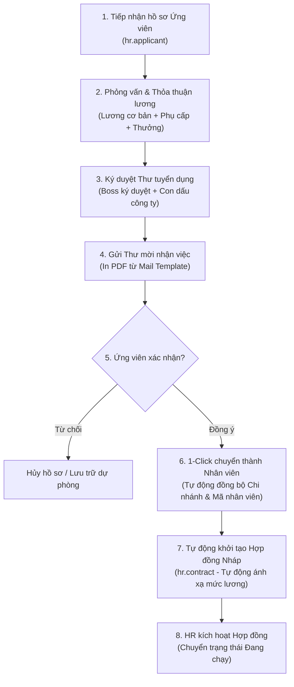

# TÀI LIỆU MÔ TẢ CHỨC NĂNG (FSD)
## PHÂN HỆ: TUYỂN DỤNG VÀ QUẢN LÝ HỢP ĐỒNG LAO ĐỘNG (Odoo 19 CE)
**Dự án:** Nâng cấp & Chuẩn hóa Hệ thống Nhân sự Đại Quang
**Phiên bản tài liệu:** v1.0
**Ngày biên soạn:** 2026-07-05

---

## 1. TỔNG QUAN PHÂN HỆ

### 1.1. Mục tiêu
Phân hệ Tuyển dụng và Quản lý Hợp đồng lao động là điểm bắt đầu trong vòng đời nhân sự của Công ty Đại Quang. Mục tiêu của phân hệ nhằm số hóa toàn bộ quy trình tiếp nhận ứng viên, thỏa thuận thu nhập, phê duyệt thư mời nhận việc, tự động hóa khâu tạo hồ sơ nhân viên và hợp đồng lao động nhằm giảm tải 95% công tác nhập liệu thủ công cho bộ phận nhân sự (HR), đảm bảo tính toàn vẹn và nhất quán của dữ liệu.

### 1.2. Đối tượng sử dụng
*   **Chuyên viên Tuyển dụng (HR Recruitment):** Tiếp nhận hồ sơ, quản lý trạng thái ứng viên, thỏa thuận lương và soạn thảo thư tuyển dụng.
*   **Trưởng phòng Nhân sự (HR Manager):** Rà soát đề xuất lương, phê duyệt và thực hiện chuyển đổi ứng viên thành nhân viên chính thức.
*   **Ban Giám đốc (CEO/Director):** Xem xét phê duyệt các đề xuất lương đặc biệt và ký duyệt điện tử thư tuyển dụng.

---

## 2. LUỒNG NGHIỆP VỤ TỔNG THỂ (WORKFLOW)

Quy trình nghiệp vụ từ ứng viên đến khi ký hợp đồng chính thức được vận hành khép kín trên Odoo 19 theo sơ đồ sau:

---

## 3. MÔ TẢ CHỨC NĂNG CHI TIẾT (DETAILED FUNCTIONS)

### 3.1. Quản lý Hồ sơ Ứng viên (`hr.applicant`)
Hồ sơ ứng viên được mở rộng các trường dữ liệu tùy biến nhằm thu thập đầy đủ lý lịch pháp lý ngay từ vòng phỏng vấn:
*   **Thông tin cá nhân cơ bản:** Họ tên, ngày sinh, giới tính, số điện thoại, email liên hệ.
*   **Thông tin định danh:** Số CMND/CCCD, ngày cấp, nơi cấp.
*   **Đính kèm hồ sơ điện tử:**
    *   Ảnh chụp CCCD (Mặt trước & Mặt sau).
    *   File Sơ yếu lý lịch (SYLL) / CV cá nhân.
    *   File Giấy khám sức khỏe (định dạng PDF/Ảnh).
*   **Thông tin tổ chức tuyển dụng:**
    *   **Chi nhánh tuyển dụng (`branch_id`):** Trường thông tin **bắt buộc** dùng để phân loại ứng viên theo khu vực địa lý của Đại Quang.
    *   Phòng ban đề xuất (`department_id`) và Chức danh tuyển dụng (`job_id`).

### 3.2. Cấu trúc Lương đề xuất & Tự động dịch số tiền thành chữ
Hồ sơ ứng viên tích hợp sẵn cấu trúc thu nhập chi tiết đã thỏa thuận trong buổi phỏng vấn để làm căn cứ trình duyệt:
*   **Lương cơ bản đề xuất (`salary_basic_proposed`):** Mức lương làm căn cứ đóng bảo hiểm xã hội.
*   **Lương trách nhiệm đề xuất (`salary_responsible_proposed`):** Phụ cấp cho các vị trí quản lý hoặc chịu trách nhiệm đặc thù.
*   **Lương tay nghề/kinh nghiệm đề xuất (`salary_experience_proposed`):** Phụ cấp năng lực chuyên môn của nhân sự.
*   **Bảng phụ cấp hàng tháng (`alw_ids`):** Cho phép HR khai báo danh mục phụ cấp (Phụ cấp ăn trưa, Phụ cấp xăng xe/đi lại, Phụ cấp điện thoại...) với số tiền cụ thể.
*   **Bảng thưởng định kỳ (`reward_ids`):** Khai báo các khoản thưởng thỏa thuận (Thưởng doanh số, thưởng chuyên cần...).
*   **Bảng giảm trừ (`cutdown_ids`):** Các khoản giảm trừ thỏa thuận đặc biệt (nếu có).
*   **Công thức tính lương tự động:**
    *   Lương Gross đề xuất = Lương cơ bản + Lương trách nhiệm + Lương kinh nghiệm + Tổng phụ cấp + Tổng thưởng
    *   Lương Net đề xuất = Lương Gross - Tổng giảm trừ - Các khoản trích đóng bảo hiểm bắt buộc
*   **Tự động dịch số tiền thành chữ:** Khi hệ thống tính toán ra tổng mức lương Net/Gross đề xuất, Odoo sẽ tự động chuyển đổi số tiền này thành chữ tiếng Việt (Ví dụ: `15.500.000` ➔ *"Mười lăm triệu năm trăm nghìn đồng chẵn"*) hiển thị trên giao diện và in lên thư mời nhận việc.

### 3.3. Phê duyệt & Kết xuất Thư mời nhận việc (Offer Letter)
*   **Quy trình ký duyệt điện tử:** Tích hợp trường thông tin Người ký duyệt (`boss_ids`) và hình ảnh con dấu đại diện của Đại Quang (`seal_image`) trên form ứng viên.
*   **Lựa chọn mẫu thư mời:** Thêm trường dropdown danh sách **Mẫu Thư Tuyển Dụng (`offer_template_id`)** trên form ứng viên. HR có thể dễ dàng lựa chọn mẫu phù hợp với vị trí tuyển dụng.
*   **Thiết kế sẵn 3 Mẫu Thư tuyển dụng tiêu chuẩn (Pre-designed Templates):**
    Hệ thống Odoo 19 được cài đặt sẵn 3 mẫu thư tuyển dụng động chuyên nghiệp:
    1.  **Mẫu 1 - Thư mời nhận việc Khối Văn phòng:**
        *   *Nội dung:* Chào đón nhân sự văn phòng, mô tả thời gian làm việc hành chính cố định (8:00 - 17:00), chế độ lương tháng cố định, KPIs công việc và thời gian review định kỳ.
    2.  **Mẫu 2 - Thư mời nhận việc Khối Nhà máy/Sản xuất:**
        *   *Nội dung:* Cấu trúc giờ làm việc theo ca, các hệ số nhân tăng ca (OT) theo quy chế nhà máy, chế độ phụ cấp ăn ca/độc hại, trang bị bảo hộ lao động và cam kết tuân thủ quy trình an toàn sản xuất.
    3.  **Mẫu 3 - Thư mời thử việc (Áp dụng chung):**
        *   *Nội dung:* Thỏa thuận thời gian thử việc (30 ngày hoặc 60 ngày), mức lương thử việc bằng 85% mức lương chính thức, điều kiện đánh giá đạt yêu cầu sau thử việc để chuyển sang hợp đồng chính thức.
*   **Soạn thảo WYSIWYG Template:** Các mẫu trên đều chạy bằng Mail Template chuẩn của Odoo 19. HR có thể tự sửa mẫu thư mời nhận việc (định dạng, font chữ, logo công ty, điều khoản làm việc) trực tiếp trên giao diện quản trị mà không cần sửa code XML.
*   **Các kênh phân phối Thư mời nhận việc:**
    *   **In Thư tuyển dụng (PDF):** Tích hợp nút bấm **"In Thư Tuyển Dụng"** trên form Ứng viên. Hệ thống tự động lấy nội dung của mẫu đã chọn (`offer_template_id`), điền các tham số động của ứng viên (Tên, Chức danh, Chi tiết lương dịch bằng chữ) và kết xuất thành tệp tin PDF trong 1 giây để tải về hoặc in trực tiếp.
    *   **Gửi qua Email tự động:** Nếu trường Email của ứng viên có dữ liệu, Odoo hiển thị nút bấm **"Gửi Email Thư Mời"**. Khi click, hệ thống tự động tạo email mẫu, đính kèm file PDF Thư mời nhận việc đã xuất ở trên và gửi trực tiếp tới email của ứng viên. Lịch sử gửi và tài liệu đính kèm sẽ được lưu vết trong Chatter của hồ sơ ứng viên.
    *   **Gửi qua Zalo OA (ZNS):** Nếu ứng viên có số điện thoại di động, Odoo hiển thị nút bấm **"Gửi Zalo Thư Mời"**. Khi nhấn nút, Odoo sẽ gọi module kết nối trung gian `daiquang_zalo_api` để đẩy tin nhắn Zalo chúc mừng trúng tuyển kèm các thông tin lương thỏa thuận tóm tắt trực tiếp vào ứng dụng Zalo của ứng viên. Mọi kết quả gửi (Thành công / Thất bại) đều được ghi nhận ngược lại Chatter để HR kiểm soát.

### 3.4. Chuyển đổi ứng viên thành nhân viên chính thức (1-Click Hire)
Khi ứng viên đồng ý nhận việc, HR nhấn nút **"Tạo Nhân viên"** (Create Employee) trên hồ sơ ứng viên. Hệ thống thực hiện các logic tự động sau:
*   **Đồng bộ thông tin:** Tự động sao chép toàn bộ lý lịch, số CCCD, ngày sinh, và các file đính kèm (CV, ảnh CCCD, y tế) sang hồ sơ nhân sự mới (`hr.employee`).
*   **Đồng bộ bắt buộc trường Chi nhánh:** Tự động truyền thông tin Chi nhánh (`branch_id`) sang hồ sơ nhân sự mới nhằm tránh lỗi thiếu thông tin bắt buộc khi lưu.
*   **Tự động sinh Mã nhân sự phân cấp:** Khi hồ sơ nhân viên được lưu, hệ thống tự động sinh Mã nhân viên theo luật phân cấp của Đại Quang:
    Mã nhân viên = Mã công ty + Mã chi nhánh + Mã phòng ban + Số thứ tự tăng dần (4 chữ số)
    *(Ví dụ: DQ-HN-NS-0012)*

### 3.5. Tự động khởi tạo Hợp đồng lao động nháp (`hr.contract`)
Để loại bỏ hoàn toàn việc HR phải nhập lại thông tin lương từ hồ sơ tuyển dụng sang hợp đồng:
*   Đồng thời với thao tác bấm "Tạo nhân viên", Odoo sẽ tự động sinh ra một bản ghi **Hợp đồng lao động ở trạng thái Nháp (Draft)** liên kết với nhân sự đó.
*   **Tự động ánh xạ (Mapping) dữ liệu lương:**
    *   Lương cơ bản đề xuất (`salary_basic_proposed`) ➔ Điền vào trường Lương cơ bản hợp đồng (`wage`).
    *   Lương trách nhiệm đề xuất (`salary_responsible_proposed`) ➔ Điền vào trường Phụ cấp trách nhiệm hợp đồng (`salary_responsible`).
    *   Lương kinh nghiệm đề xuất (`salary_experience_proposed`) ➔ Điền vào trường Phụ cấp kinh nghiệm hợp đồng (`salary_experience`).
    *   Các dòng phụ cấp và thưởng chi tiết trong bảng của ứng viên ➔ Tự động tạo các dòng phụ cấp, thưởng tương ứng trên bảng phụ cấp hợp đồng lao động.
*   HR chỉ cần vào kiểm tra lại điều khoản hợp đồng, ngày ký, ngày hiệu lực và bấm **"Kích hoạt Hợp đồng"** để chuyển sang trạng thái **Đang chạy (Running)**.

### 3.6. Cấu trúc Lương Hợp đồng & Các khoản đóng góp bảo hiểm theo Luật định
Để đảm bảo tính pháp lý và tuân thủ Luật Lao động & Luật Bảo hiểm xã hội Việt Nam, hợp đồng lao động (`hr.contract`) cấu hình chi tiết các khoản chi trả của Người lao động (khấu trừ lương) và Người sử dụng lao động (tính vào chi phí doanh nghiệp):

#### 3.6.1. Định nghĩa các khoản thu nhập trên Hợp đồng
*   **Thu nhập tính đóng BHXH bắt buộc:** Bao gồm Lương cơ bản (`wage`) + Phụ cấp trách nhiệm (`salary_responsible`) + Phụ cấp kinh nghiệm (`salary_experience`).
*   **Thu nhập không tính đóng BHXH (Các khoản phụ cấp phúc lợi ngoài bảo hiểm):** Phụ cấp ăn trưa, phụ cấp xăng xe/đi lại, phụ cấp điện thoại, phụ cấp nhà ở. Các khoản này được ghi nhận riêng biệt trên bảng phụ cấp hợp đồng.

#### 3.6.2. Cấu hình Tham số trích đóng Bảo hiểm (Configurable Rates)
Odoo thiết lập các trường Checkbox và mức lương làm căn cứ đóng bảo hiểm trực tiếp trên giao diện hợp đồng:
*   `has_social_insurance`: Checkbox xác định nhân viên có tham gia BHXH bắt buộc hay không (ví dụ: Nhân viên thử việc hoặc người đã nghỉ hưu sẽ không tích chọn).
*   `has_health_insurance`: Checkbox tham gia BHYT.
*   `has_unemployment_insurance`: Checkbox tham gia BHTN.
*   `insurance_salary_base`: Mức lương làm căn cứ đóng BHXH. Mặc định hệ thống tự động cộng dồn: `wage` + `salary_responsible` + `salary_experience`. Cho phép HR ghi đè bằng tay nếu có thỏa thuận đặc thù.

#### 3.6.3. Tỷ lệ đóng góp theo Luật định hiện hành
Hệ thống tự động phân bổ tỷ lệ trích đóng bảo hiểm và kinh phí công đoàn hàng tháng dựa trên mức lương đóng bảo hiểm (`insurance_salary_base`) như sau:

| Loại bảo hiểm / Phí | Tỷ lệ DN chi trả (Tính vào chi phí) | Tỷ lệ NLĐ chi trả (Khấu trừ lương) | Tổng tỷ lệ trích nộp |
| :--- | :--- | :--- | :--- |
| **Bảo hiểm Xã hội (BHXH)** | 17.5% | 8.0% | 25.5% |
| **Bảo hiểm Y tế (BHYT)** | 3.0% | 1.5% | 4.5% |
| **Bảo hiểm Thất nghiệp (BHTN)** | 1.0% | 1.0% | 2.0% |
| **Kinh phí Công đoàn (KPCĐ)** | 2.0% | 0.0% | 2.0% |
| **TỔNG CỘNG** | **23.5%** | **10.5%** | **34.0%** |

*   *Trần đóng bảo hiểm:* Hệ thống tự động giới hạn mức lương đóng bảo hiểm tối đa theo quy định nhà nước (Ví dụ: BHXH & BHYT tối đa bằng 20 lần mức lương cơ sở; BHTN tối đa bằng 20 lần mức lương tối thiểu vùng).

#### 3.6.4. Khấu trừ Thuế Thu nhập Cá nhân (Thuế TNCN)
Hệ thống tự động thực hiện tính toán khấu trừ Thuế TNCN lũy tiến của người lao động sau khi trừ đi các khoản giảm trừ hợp lệ trên hợp đồng. Tất cả các mức giảm trừ gia cảnh này được cấu hình tùy biến động thay vì lập trình cứng:
*   **Giảm trừ bản thân (khấu trừ động):** Lấy giá trị cấu hình tại Cài đặt hệ thống (Ví dụ theo luật mới hoặc luật hiện hành).
*   **Giảm trừ người phụ thuộc (khấu trừ động):** Lấy giá trị cấu hình nhân với số lượng người phụ thuộc khai báo (`dependent_ids`) trên hồ sơ nhân sự.
*   **Giảm trừ bảo hiểm bắt buộc:** Tự động trừ đi các khoản trích đóng bảo hiểm thuộc phần người lao động chi trả (10.5% của lương đóng bảo hiểm thực tế).
*   **Biểu thuế suất lũy tiến từng phần:** Áp dụng các bậc thuế lũy tiến từ 5% đến 35% theo biểu thuế thu nhập cá nhân quy định.
*   **Thuế suất thử việc:** Đối với lao động thử việc hoặc lao động thời vụ dưới 3 tháng có tổng thu nhập vượt mức tối thiểu quy định, hệ thống hỗ trợ tích chọn khấu trừ thuế suất cố định 10% (hoặc áp dụng cam kết mẫu 08 trích lục tạm miễn thuế).

#### 3.6.5. Cấu hình tham số Hệ thống (Settings & Configuration)
Để đáp ứng các thay đổi về luật thuế và bảo hiểm trong tương lai mà không cần can thiệp sửa code, Odoo 19 cung cấp giao diện cấu hình trực quan tại **Settings ➔ Human Resources ➔ Payroll & Contract Configuration**:
*   `pit_personal_deduction`: Cấu hình số tiền giảm trừ bản thân (Cho phép chỉnh sửa tùy biến, ví dụ: 11,000,000 VNĐ hoặc điều chỉnh tăng theo luật mới).
*   `pit_dependent_deduction`: Cấu hình số tiền giảm trừ cho mỗi người phụ thuộc (Ví dụ: 4,400,000 VNĐ hoặc mức điều chỉnh mới).
*   `insurance_contribution_rates`: Cho phép điều chỉnh tỷ lệ đóng BHXH, BHYT, BHTN của cả Doanh nghiệp và Người lao động nếu Nhà nước thay đổi tỷ lệ trích nộp.

---

---

## 4. GIAO DIỆN NGƯỜI DÙNG & TÍNH RESPONSIVE MOBILE

*   **Giao diện Form hiện đại (Odoo 19):** Form ứng viên được tổ chức thành các Tab thông tin riêng biệt để HR dễ quản lý:
    *   *Tab 1: Thông tin ứng tuyển & Lý lịch pháp lý* (bao gồm CCCD và File đính kèm).
    *   *Tab 2: Chi tiết thỏa thuận lương* (chứa các trường số tiền đề xuất và bảng phụ cấp/thưởng).
    *   *Tab 3: Ký duyệt & Con dấu*.
*   **Tương thích Thiết bị di động (Responsive):** Toàn bộ giao diện form sử dụng hệ thống lưới Bootstrap 5 của Odoo 19, các trường thông tin tự động co giãn và chuyển sang bố cục 1 cột khi HR truy cập bằng điện thoại di động hoặc máy tính bảng để phỏng vấn ứng viên trực tiếp tại xưởng hoặc chi nhánh.

---

## 5. YÊU CẦU PHÂN QUYỀN VÀ BẢO MẬT (SECURITY)

*   **Chuyên viên Tuyển dụng (Recruitment User):** Có quyền Tạo, Sửa hồ sơ ứng viên thuộc chi nhánh được phân quyền quản lý; có quyền in thư mời nhận việc. Không có quyền sửa đổi cấu hình định mục lương chung của công ty.
*   **Trưởng phòng Nhân sự (HR Manager):** Có quyền duyệt hồ sơ lương, thực hiện chuyển đổi ứng viên thành nhân viên chính thức, kích hoạt hợp đồng lao động.
*   **Ban Giám đốc (CEO/Director):** Có quyền xem hồ sơ ứng viên toàn công ty và thực hiện ký duyệt thư tuyển dụng.
*   **Bảo mật thông tin lương:** Các trường thông tin thu nhập đề xuất của ứng viên và hợp đồng lao động chỉ hiển thị với HR và Ban giám đốc, nhân viên thông thường hoặc các bộ phận khác không thể nhìn thấy.

---
