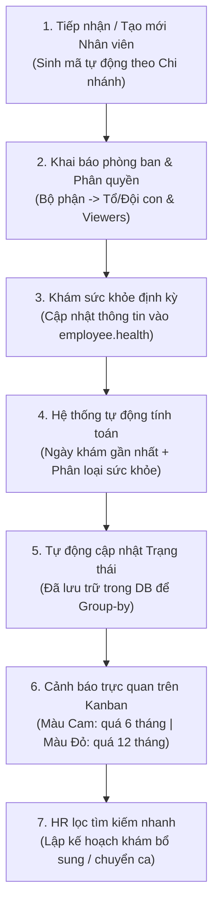

# TÀI LIỆU MÔ TẢ CHỨC NĂNG (FSD)
## PHÂN HỆ: QUẢN LÝ NHÂN SỰ VÀ SỨC KHỎE ĐỊNH KỲ (Odoo 19 CE)
**Dự án:** Nâng cấp & Chuẩn hóa Hệ thống Nhân sự Đại Quang
**Phiên bản tài liệu:** v1.0
**Ngày biên soạn:** 2026-07-05

---

## 1. TỔNG QUAN PHÂN HỆ

### 1.1. Mục tiêu
Phân hệ Quản lý Nhân sự nhằm quản lý toàn diện hồ sơ thông tin cán bộ nhân viên, cấu trúc sơ đồ tổ chức đa cấp và quản lý y tế lao động (khám sức khỏe định kỳ). Chức năng cốt lõi là theo dõi tự động tình trạng sức khỏe của nhân viên sản xuất/văn phòng, đưa ra các cảnh báo trực quan bằng màu sắc trên giao diện Kanban và cung cấp bộ lọc nhanh giúp bộ phận Hành chính Nhân sự (HR) lập kế hoạch khám sức khỏe định kỳ, đảm bảo tuân thủ quy định y tế lao động của Nhà nước đối với các doanh nghiệp sản xuất.

### 1.2. Đối tượng sử dụng
*   **Chuyên viên Nhân sự (HR Officer):** Cập nhật hồ sơ nhân sự, phòng ban, và nhập kết quả khám sức khỏe định kỳ.
*   **Trưởng bộ phận (Department Manager / Viewer):** Theo dõi danh sách nhân sự thuộc phạm vi phòng ban/tổ đội quản lý thông qua phân quyền xem dữ liệu.
*   **Bộ phận Y tế công ty / Ban an toàn lao động:** Theo dõi báo cáo tổng hợp và danh sách cảnh báo y tế để bố trí công việc phù hợp.

---

## 2. LUỒNG NGHIỆP VỤ TỔNG THỂ (WORKFLOW)

---

## 3. MÔ TẢ CHỨC NĂNG CHI TIẾT

### 3.1. Sơ đồ tổ chức đa phân cấp & Phân quyền phòng ban (`viewers_ids`)
*   **Phân cấp Phòng ban sâu:** Hệ thống hỗ trợ cấu trúc phòng ban nhiều cấp (Tổng công ty ➔ Chi nhánh ➔ Phòng ban lớn ➔ Các Tổ / Đội / Nhóm sản xuất con) thông qua quan hệ Cha - Con kế thừa trên mô hình phòng ban (`hr.department`).
*   **Phân quyền xem dữ liệu (`viewers_ids`):**
    *   Tích hợp trường danh sách người xem (`viewers_ids`) trên form cấu hình Phòng ban.
    *   Cho phép HR chỉ định các User (không cần quyền Admin/HR Manager) được phép xem toàn bộ hồ sơ nhân sự thuộc phòng ban đó và các phòng ban con của nó.
    *   *Lợi ích:* Giúp Trưởng bộ phận hoặc Tổ trưởng sản xuất theo dõi được tình hình nhân sự của tổ mình mà không được can thiệp hoặc xem thông tin nhạy cảm của tổ/phòng ban khác.

### 3.2. Quản lý Lịch sử Khám sức khỏe định kỳ
Tích hợp bảng theo dõi khám sức khỏe (`employee.health`) dạng lưới chi tiết (One2many) trên Form Nhân sự:
*   **Thông tin ghi nhận mỗi đợt khám:**
    *   Ngày thực hiện khám sức khỏe.
    *   Cơ sở y tế / Bệnh viện thực hiện khám.
    *   Kết quả phân loại sức khỏe: Lựa chọn từ Loại I (Rất khỏe) đến Loại V (Rất yếu) theo quy định Bộ Y tế.
    *   Ghi chú chi tiết về bệnh lý hoặc hạn chế lao động (ví dụ: Không được làm việc trên cao, không làm việc nặng...).
    *   Tệp tin đính kèm (File PDF/ảnh chụp Giấy khám sức khỏe).

### 3.3. Tự động tính toán Trạng thái Y tế (Lưu trữ trong Database)
Hệ thống tự động chạy logic cập nhật các thông tin y tế tổng hợp của nhân viên ngay khi có bản ghi khám sức khỏe mới được lưu:
*   **Ngày khám gần nhất (`last_health_date`):** Tự động tìm ngày khám có thời gian lớn nhất trong lịch sử khám sức khỏe của nhân viên.
*   **Phân loại sức khỏe gần nhất (`last_health_type`):** Lấy kết quả phân loại sức khỏe của đợt khám gần nhất.
*   **Trạng thái khám sức khỏe (`health_status`):** Phân loại tự động dựa trên khoảng thời gian từ ngày khám gần nhất đến ngày hiện tại:
    *   *Đã khám đầy đủ:* Khoảng cách dưới 6 tháng kể từ ngày khám gần nhất.
    *   *Quá hạn 6 tháng chưa khám:* Khoảng cách từ 6 tháng đến dưới 12 tháng.
    *   *Quá hạn 12 tháng chưa khám:* Khoảng cách từ 12 tháng trở lên.
    *   *Chưa từng khám:* Nhân viên chưa có bất kỳ bản ghi lịch sử khám sức khỏe nào.
*   **MANDATORY - Lưu trữ trường trạng thái (`store=True`):** Trường trạng thái này bắt buộc phải được lưu trữ vật lý trong cơ sở dữ liệu. Điều này cho phép HR thực hiện gom nhóm (Group by) nhân viên theo Trạng thái khám sức khỏe trên màn hình danh sách để xuất báo cáo nhanh.

### 3.4. Hệ thống Cảnh báo trực quan bằng màu sắc trên Kanban view
Để HR và Quản lý nhanh chóng nhận biết các trường hợp nhân sự quá hạn khám sức khỏe hoặc sức khỏe yếu khi phân ca:
*   **Cảnh báo Màu Cam:** Hiển thị nhãn nổi bật màu Cam trên thẻ nhân sự ở Kanban view đối với nhân viên ở trạng thái *"Quá hạn 6 tháng chưa khám"*.
*   **Cảnh báo Màu Đỏ:** Hiển thị nhãn nổi bật màu Đỏ đối với nhân viên ở trạng thái *"Quá hạn 12 tháng chưa khám"* hoặc *"Chưa từng khám"*.
*   **Cảnh báo kết quả sức khỏe yếu:** Nếu phân loại sức khỏe gần nhất là Loại IV hoặc Loại V, hệ thống hiển thị biểu tượng cảnh báo nguy hiểm bên cạnh tên nhân viên để cảnh báo không bố trí các công việc nặng nhọc hoặc độc hại.

### 3.5. Bộ lọc nhanh trên thanh tìm kiếm (Quick Search Filters)
Tích hợp sẵn các bộ lọc tĩnh trong thanh tìm kiếm của giao diện Nhân sự giúp HR truy xuất dữ liệu trong 1 click:
*   **Lọc quá hạn 6 tháng:** Hiển thị toàn bộ nhân sự có `health_status` là "Quá hạn 6 tháng chưa khám".
*   **Lọc quá hạn 12 tháng:** Hiển thị toàn bộ nhân sự có `health_status` là "Quá hạn 12 tháng chưa khám".
*   **Lọc chưa từng khám:** Hiển thị toàn bộ nhân sự chưa có dữ liệu y tế.
*   *Yêu cầu kỹ thuật:* Các bộ lọc này sử dụng logic tính toán múi giờ Việt Nam (UTC+7) chuẩn xác, không bị lệch ngày do chênh lệch giờ hệ thống.

---

## 4. GIAO DIỆN NGƯỜI DÙNG & TÍNH RESPONSIVE MOBILE

*   **Kanban View hiện đại:** Thẻ nhân viên được bố trí lại thông tin gọn gàng trên Odoo 19. Các nhãn màu sắc cảnh báo sức khỏe được đặt ở góc phải thẻ để dễ quan sát trên mọi thiết bị.
*   **Form Nhân viên chi tiết:** Thêm Tab **"Thông tin Y tế & Sức khỏe"** nằm ngay sau tab Thông tin cá nhân để gom gọn bảng lịch sử khám sức khỏe và các cảnh báo liên quan.
*   **Responsive Mobile:** Form nhập lịch sử khám sức khỏe và giao diện Kanban tự động tương thích tốt trên điện thoại di động giúp nhân viên y tế tại xưởng có thể dùng điện thoại chụp ảnh giấy khám sức khỏe và đính kèm trực tiếp lên hồ sơ nhân sự.

---

## 5. YÊU CẦU BẢO MẬT & PHÂN QUYỀN

*   **Chuyên viên Nhân sự / Y tế:** Có quyền Xem, Tạo, Sửa lịch sử khám sức khỏe của nhân viên.
*   **Trưởng bộ phận (Viewer):** Có quyền xem thông tin phân loại sức khỏe gần nhất để bố trí nhân sự phù hợp, nhưng **không có quyền** sửa đổi lịch sử khám sức khỏe hoặc xem chi tiết hồ sơ bệnh lý nhạy cảm của nhân viên nếu không được phân quyền.
*   **Bảo mật tài liệu đính kèm y tế:** File đính kèm kết quả khám sức khỏe được phân quyền chỉ những người có vai trò quản lý y tế hoặc HR Manager mới có thể tải xuống.

---
