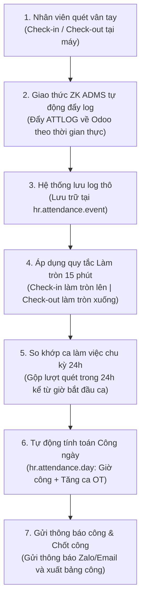

# TÀI LIỆU MÔ TẢ CHỨC NĂNG (FSD)
## PHÂN HỆ: KẾT NỐI MÁY CHẤM CÔNG ZK ADMS VÀ LOGIC TÍNH CÔNG 24H (Odoo 19 CE)
**Dự án:** Nâng cấp & Chuẩn hóa Hệ thống Nhân sự Đại Quang
**Phiên bản tài liệu:** v1.0
**Ngày biên soạn:** 2026-07-05

---

## 1. TỔNG QUAN PHÂN HỆ

### 1.1. Mục tiêu
Phân hệ Chấm công nhằm mục đích tự động hóa hoàn toàn quy trình thu thập dữ liệu chấm công từ các chi nhánh/nhà máy về văn phòng trung tâm, đồng thời xử lý tự động các bài toán ca kíp phức tạp (ca đêm gối ngày) của Công ty Đại Quang. Hệ thống kết nối trực tiếp với máy chấm công ZKTeco thông qua giao thức đẩy dữ liệu tự động (ZK ADMS/Push SDK), thực hiện làm tròn giờ quét thẻ về block 15 phút và so khớp ca làm việc theo chu kỳ 24 giờ nhằm tính toán chính xác ngày công thực tế, loại bỏ hoàn toàn các logic tùy biến thủ công và sai số.

### 1.2. Đối tượng sử dụng
*   **Chuyên viên Chấm công (HR Attendance Officer):** Quản lý thiết bị chấm công, đăng ký vân tay cho nhân sự mới, kiểm tra và chốt bảng công tháng.
*   **Nhân viên Công ty:** Quét vân tay hàng ngày tại máy và nhận thông báo kết quả công tự động qua Zalo/Email.
*   **Quản lý bộ phận / Giám đốc chi nhánh:** Giám sát thời gian làm việc, đi muộn về sớm của nhân sự trực thuộc.

---

## 2. LUỒNG NGHIỆP VỤ TỔNG THỂ (WORKFLOW)

---

## 3. MÔ TẢ CHỨC NĂNG CHI TIẾT

### 3.1. Quản lý Thiết bị chấm công ZK ADMS (`hr.zk.device`)
Hệ thống thiết lập một trình quản lý thiết bị chấm công tập trung:
*   **Khai báo thiết bị:** Quản lý tên máy, số Serial Number (SN - khóa duy nhất của máy), Chi nhánh lắp đặt (`branch_id`), Địa chỉ IP mạng nội bộ (nếu cần truy cập trực tiếp), Trạng thái hoạt động (Online/Offline).
*   **Giao thức đẩy dữ liệu ZK ADMS (ZKTeco Automatic Data Master System):**
    *   Hệ thống mở các cổng API công khai để thiết bị chấm công tự động gọi về Odoo (giao thức HTTP POST/GET).
    *   Máy chấm công tự động đẩy dữ liệu quét vân tay (`ATTLOG`) và nhật ký thao tác máy (`OPERLOG`) về Odoo ngay khi nhân viên quét thẻ/vân tay.
    *   Hệ thống Odoo tự động ghi nhận và phản hồi xác nhận lệnh giúp máy chấm công xóa bộ nhớ đệm log đã gửi, tránh đầy bộ nhớ thiết bị.

### 3.2. Quản lý Sinh trắc học & Đồng bộ Vân tay từ Odoo
*   **Lưu trữ mẫu vân tay (`hr.zk.fingerprint.template`):** Hệ thống lưu trữ các mã hóa vân tay của nhân viên liên kết trực tiếp với Mã PIN chấm công và ID nhân sự trên Odoo.
*   **Đẩy lệnh điều khiển xuống máy chấm công (Device Commands):**
    *   Khi có nhân viên mới trúng tuyển, HR chỉ cần đăng ký vân tay một lần tại máy chấm công chi nhánh. Mẫu vân tay này tự động đẩy về Odoo để lưu trữ dự phòng.
    *   Khi nhân viên luân chuyển chi nhánh, HR sử dụng nút bấm trên Odoo để đẩy lệnh truyền dữ liệu vân tay của nhân viên đó sang máy chấm công ở chi nhánh mới (`DATA USER PIN=...`).
    *   Khi nhân viên nghỉ việc, hệ thống tự động sinh lệnh xóa tài khoản và vân tay của nhân viên đó trên máy chấm công để đảm bảo bảo mật.

### 3.3. Thu nhận & Lưu vết sự kiện quét thẻ thô (`hr.attendance.event`)
*   Mọi sự kiện quét vân tay gửi về từ máy chấm công được lưu lại nguyên trạng vào mô hình **Sự kiện quét thẻ thô (`hr.attendance.event`)** bao gồm: *Mã PIN chấm công, ID máy chấm công, Thời gian quét thô, Kiểu quét (check-in/check-out/quét tự do)*.
*   *Lợi ích:* Làm căn cứ đối chiếu pháp lý khi nhân viên có thắc mắc hoặc tranh chấp về giờ công thực tế so với giờ làm tròn của hệ thống.

### 3.4. Logic Làm tròn 15 phút & Khớp ca kíp chu kỳ 24h
Đây là logic cốt lõi thay thế hoàn toàn các logic tùy biến cũ để tính công tự động:
*   **Quy tắc làm tròn 15 phút (15-Minute Block Rounding):**
    *   *Giờ Check-in:* Được làm tròn **lên** mốc 15 phút gần nhất trước khi đưa vào tính toán. 
        *(Ví dụ: Nhân viên quét vân tay vào lúc 07:51 hoặc 07:59 ➔ Hệ thống đều làm tròn giờ Check-in tính toán thành 08:00)*.
    *   *Giờ Check-out:* Được làm tròn **xuống** mốc 15 phút gần nhất trước khi đưa vào tính toán.
        *(Ví dụ: Nhân viên quét vân tay ra lúc 17:05 hoặc 17:14 ➔ Hệ thống đều làm tròn giờ Check-out tính toán thành 17:00)*.
*   **Logic khớp ca kíp chu kỳ 24 giờ (Ca đêm gối ngày):**
    *   Hệ thống định nghĩa ca làm việc với giờ bắt đầu (ví dụ: Ca đêm bắt đầu từ 22:00 hôm trước đến 06:00 sáng hôm sau).
    *   Khi nhân viên check-in bắt đầu ca, hệ thống mở ra một **Chu kỳ 24 giờ** tính từ thời điểm bắt đầu ca đó. Mọi lượt check-in và check-out kế tiếp của nhân sự diễn ra trong vòng 24 giờ này sẽ được tự động gom nhóm và tính toán vào cùng **1 ngày công duy nhất** của ngày bắt đầu ca.
    *   *Lợi ích:* Giải quyết triệt để lỗi của hệ thống cũ khi nhân viên quét vân tay ra ca đêm vào sáng hôm sau (ví dụ: 06:00 sáng) bị hệ thống hiểu nhầm là check-in của ngày mới hoặc tách thành 2 ngày công lẻ.

### 3.5. Bảng công ngày đã xử lý (`hr.attendance.day`)
*   Sau khi làm tròn và khớp ca, Odoo tự động tính toán ra bảng công ngày chi tiết cho từng nhân viên:
    *   *Số giờ làm việc thực tế (giờ làm tròn).*
    *   *Số ngày công quy đổi:* 1.0 công (nếu làm đủ ca), 0.5 công (làm nửa ca), 0.0 công (nghỉ không phép/nghỉ phép).
    *   *Số giờ tăng ca (Overtime - OT):* Tự động tính số giờ làm thêm ngoài ca tiêu chuẩn dựa trên cấu hình hệ số tăng ca ngày thường, ngày chủ nhật hoặc ngày lễ.
*   Bảng công này là cơ sở dữ liệu duy nhất và chuẩn xác nhất để tự động đồng bộ sang bảng tính lương cuối tháng.

---

## 4. GIAO DIỆN NGƯỜI DÙNG & TÍNH RESPONSIVE MOBILE

*   **Màn hình Giám sát Thiết bị (Device Dashboard):** Hiển thị danh sách máy chấm công kèm trạng thái Online/Offline bằng chấm tròn Xanh/Đỏ trực quan.
*   **Màn hình bảng công ngày dạng lưới (Pivot View):** HR có thể xem tổng hợp công dưới dạng bảng Pivot (hàng dọc là nhân viên, hàng ngang là các ngày trong tháng) để so sánh và kiểm tra nhanh.
*   **Tương thích Mobile:** Cung cấp giao diện responsive giúp HR có thể kiểm tra danh sách máy chấm công mất kết nối hoặc duyệt nhanh các trường hợp xin giải trình chấm công (quên quét thẻ) của nhân viên trực tiếp trên điện thoại di động.

---

## 5. YÊU CẦU PHÂN QUYỀN VÀ BẢO BẬT

*   **Cán bộ Chấm công (Attendance Officer):** Có quyền cấu hình ca làm việc, quản lý danh sách thiết bị chấm công, phê duyệt giải trình chấm công của nhân viên.
*   **Nhân viên thường:** Chỉ có quyền xem lịch sử chấm công ngày (`hr.attendance.day`) và thực hiện gửi phiếu giải trình chấm công (xin bổ sung công) của bản thân trên giao diện Portal/Mobile, không có quyền can thiệp vào máy chấm công hay hồ sơ công của người khác.
*   **Bảo mật dữ liệu sinh trắc học:** Mẫu vân tay lưu trên Odoo được mã hóa nhị phân an toàn, không hiển thị dưới dạng hình ảnh vân tay thô nhằm bảo mật tuyệt đối thông tin sinh trắc học của người lao động.

---
