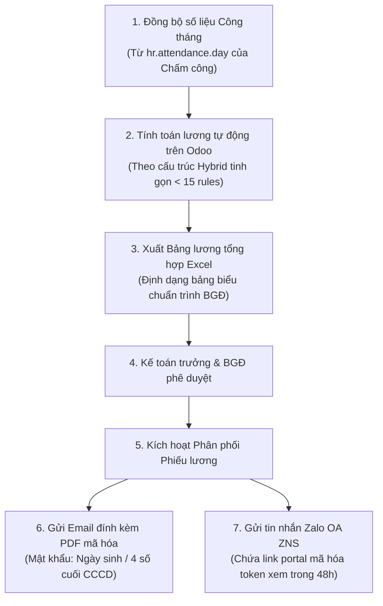

# TÀI LIỆU MÔ TẢ CHỨC NĂNG (FSD)
## PHÂN HỆ: TÍNH LƯƠNG LAI TINH GỌN VÀ PHÂN PHỐI PHIẾU LƯƠNG BẢO MẬT (Odoo 19 CE)
**Dự án:** Nâng cấp & Chuẩn hóa Hệ thống Nhân sự Đại Quang
**Phiên bản tài liệu:** v1.0
**Ngày biên soạn:** 2026-07-05

---

## 1. TỔNG QUAN PHÂN HỆ

### 1.1. Bối cảnh & Mục tiêu
Hệ thống cũ cấu hình tính lương quá tải với **148 quy tắc (salary rules)** chứa mã code Python trực tiếp trong cơ sở dữ liệu. Thiết kế này cực kỳ phức tạp, dễ gây lỗi biên dịch khi nâng cấp và làm suy giảm hiệu năng hệ thống. 
Mục tiêu của phân hệ Tính lương nâng cấp là áp dụng **Mô hình lương lai tinh gọn (Hybrid Payroll)**: đơn giản hóa cấu trúc xuống **dưới 15 quy tắc lương cốt lõi**, lấy trực tiếp số liệu ngày công và tăng ca đã xử lý từ phân hệ Chấm công và tự động hóa khâu xuất bảng lương tổng hợp Excel. Đồng thời tích hợp tính năng tự động phân phối phiếu lương cá nhân bảo mật cao thông qua Email (file PDF mã hóa mật khẩu) và Zalo OA (tin nhắn ZNS chứa mã token xem nhanh).

### 1.2. Đối tượng sử dụng
*   **Chuyên viên Lương (Payroll Specialist):** Tính toán lương tháng, đối chiếu số liệu công, xuất bảng lương Excel trình duyệt.
*   **Kế toán trưởng & Ban Giám đốc:** Rà soát bảng lương tổng hợp và phê duyệt chi trả lương.
*   **Nhân viên Công ty:** Nhận phiếu lương bảo mật qua Zalo/Email cá nhân và phản hồi nếu có sai lệch.

---

## 2. LUỒNG NGHIỆP VỤ TỔNG THỂ (WORKFLOW)

---

## 3. MÔ TẢ CHỨC NĂNG CHI TIẾT

### 3.1. Cấu trúc Lương Lai tinh gọn (Hybrid Payroll)
Hệ thống loại bỏ hoàn toàn các rule tính toán phụ trợ phức tạp trong cơ sở dữ liệu, quy chuẩn cấu trúc lương về dưới 15 quy tắc chính:

| Mã Rule | Tên quy tắc lương | Công thức tính toán |
| :--- | :--- | :--- |
| `BASIC` | Lương cơ bản thực tế | `Lương cơ bản hợp đồng (wage) / 26 ngày công chuẩn * Số ngày công thực tế` |
| `ALW_RESP`| Phụ cấp trách nhiệm thực tế| `Phụ cấp trách nhiệm hợp đồng / 26 * Số ngày công thực tế` |
| `ALW_EXP` | Phụ cấp kinh nghiệm thực tế | `Phụ cấp kinh nghiệm hợp đồng / 26 * Số ngày công thực tế` |
| `ALW_FIX` | Các phụ cấp phúc lợi cố định | Ăn trưa, xăng xe, điện thoại (tính theo ngày công làm việc thực tế hoặc cố định) |
| `OVERTIME`| Lương tăng ca (OT) | `Tổng số giờ OT quy đổi hệ số * Đơn giá lương giờ` |
| `GROSS` | Tổng thu nhập Gross | `BASIC + ALW_RESP + ALW_EXP + ALW_FIX + OVERTIME` |
| `INS_EE` | Bảo hiểm NLĐ đóng | `insurance_salary_base * 10.5%` (Khấu trừ vào lương nhân viên) |
| `INS_ER` | Bảo hiểm DN đóng | `insurance_salary_base * 23.5%` (Tính vào chi phí DN, không trừ vào lương) |
| `TAX_TNCN`| Thuế thu nhập cá nhân | Áp dụng biểu thuế lũy tiến từng phần dựa trên cấu hình giảm trừ gia cảnh động |
| `DEDUCT` | Các khoản giảm trừ khác | Giảm trừ ứng trước lương, phạt kỷ luật... |
| `NET` | Lương thực nhận | `GROSS - INS_EE - TAX_TNCN - DEDUCT` |

### 3.2. Xuất Bảng lương tổng hợp Excel chuyên nghiệp
*   Tích hợp nút bấm **"Xuất Bảng Lương Excel"** trên giao diện Bảng lương tháng (`hr.payslip.run`).
*   **Yêu cầu định dạng File Excel xuất ra:**
    *   *Tiêu đề:* Chứa tên công ty Đại Quang, tên bảng lương tháng, chi nhánh.
    *   *Cột dữ liệu:* Mã nhân viên, Họ tên, Phòng ban, Số tài khoản ngân hàng, Công chuẩn, Công thực tế, Chi tiết từng khoản thu nhập (Lương cơ bản, phụ cấp trách nhiệm, phụ cấp tay nghề, phụ cấp ăn trưa, xăng xe, tiền tăng ca), Chi tiết bảo hiểm trích nộp, Thuế TNCN, Các khoản giảm trừ khác và cột Lương thực nhận Net.
    *   *Trình bày:* Căn lề số tiền sang bên phải, có ngăn cách hàng nghìn (ví dụ: `15,000,000`), định dạng tiêu đề cột nổi bật, tự động tính tổng (SUM) ở dòng cuối cùng của bảng.

### 3.3. Phân phối Phiếu lương qua Email mã hóa (Password Encrypted PDF)
*   Hệ thống tự động kết xuất phiếu lương chi tiết của từng cá nhân thành file PDF.
*   **Mã hóa mật khẩu bảo vệ (Security PDF):** Để bảo vệ thông tin thu nhập cá nhân nhạy cảm, file PDF đính kèm email sẽ được mã hóa tự động bằng mật khẩu cá nhân của nhân sự đó.
    *   *Quy tắc mật khẩu:* Được lấy theo **Ngày sinh của nhân viên** (Định dạng: `DDMMYYYY`, ví dụ sinh ngày 05/09/1995 mật khẩu sẽ là `05091995`) hoặc **4 số cuối của CCCD**.
*   Khi nhân viên nhận được email, bắt buộc phải nhập đúng mật khẩu mới có thể mở và đọc nội dung phiếu lương PDF.

### 3.4. Phân phối Phiếu lương qua Zalo OA (Secure Portal Link with Token)
Để thuận tiện cho công nhân nhà máy không sử dụng email thường xuyên:
*   Hệ thống hỗ trợ gửi tin nhắn Zalo ZNS báo đã có phiếu lương tháng trực tiếp vào số Zalo của nhân viên.
*   **Link truy cập Portal bảo mật:** Tin nhắn chứa nút bấm "Xem phiếu lương". Khi nhân viên click vào nút này, hệ thống sẽ mở trình duyệt web hiển thị trực tiếp phiếu lương của họ trên giao diện Odoo Portal di động.
*   **Mã xác thực Token bảo mật:** Đường link chứa mã token ngẫu nhiên được sinh ra tự động (Ví dụ: `/my/payslip/12?token=abc123xyz`). Mã token này có thời hạn hết hạn trong vòng **48 giờ** và chỉ cho phép truy cập đúng phiếu lương của chính nhân sự đó mà không yêu cầu họ phải đăng nhập tài khoản Odoo, đảm bảo tính bảo mật và sự tiện lợi tối đa.

---

## 4. YÊU CẦU PHÂN QUYỀN

*   **Chuyên viên Lương (Payroll Officer):** Tính toán lương, xuất bảng lương Excel, thực hiện thao tác bấm gửi hàng loạt phiếu lương qua Email/Zalo.
*   **Kế toán trưởng / Giám đốc:** Duyệt bảng lương tổng hợp trên hệ thống.
*   **Nhân viên thường:** Không có bất kỳ quyền truy cập nào vào phân hệ Lương Admin. Chỉ được xem phiếu lương của cá nhân mình qua link Zalo Portal hoặc file PDF trong Email.

---
