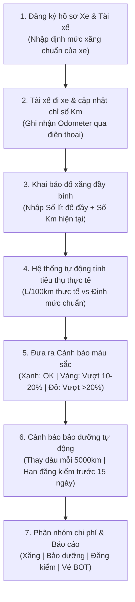

# TÀI LIỆU MÔ TẢ CHỨC NĂNG (FSD)
## PHÂN HỆ: QUẢN LÝ PHƯƠNG TIỆN VÀ CHI PHÍ VẬN HÀNH ĐỘI XE (Odoo 19 CE)
**Dự án:** Nâng cấp & Chuẩn hóa Hệ thống Nhân sự Đại Quang
**Phiên bản tài liệu:** v1.0
**Ngày biên soạn:** 2026-07-06

---

## 1. TỔNG QUAN PHÂN HỆ

### 1.1. Bối cảnh & Mục tiêu
Công ty Đại Quang hiện đang quản lý đội xe và chi phí vận hành (nhật trình, tiêu thụ nhiên liệu, bảo dưỡng) thủ công trên tệp tin Excel `So_quan_ly_xe_DQ.xlsx`. Quy trình này phụ thuộc nhiều vào việc nhập liệu thủ công của tài xế và kế toán, dễ xảy ra sai sót, khó kiểm soát định mức tiêu thụ thực tế và dễ quên lịch bảo dưỡng/đăng kiểm định kỳ của xe.
Mục tiêu của phân hệ Quản lý Đội xe là số hóa toàn bộ quy trình lên Odoo 19: tự động hóa việc tính toán định mức tiêu hao xăng thực tế (yêu cầu đổ đầy bình mỗi lần), đưa ra cảnh báo trực quan bằng màu sắc khi vượt định mức xăng, tự động nhắc lịch thay dầu máy (mỗi 5,000 km) và hạn đăng kiểm kế tiếp, đồng thời phân tách chi phí vận hành thành 4 nhóm độc lập phục vụ kiểm soát tài chính.

### 1.2. Đối tượng sử dụng
*   **Bộ phận điều phối xe / Hành chính (Fleet Admin):** Quản lý hồ sơ xe, sắp xếp lịch trực tài xế và phân xe cho các chuyến đi.
*   **Tài xế công ty:** Báo cáo chỉ số Km và nhập phiếu đổ xăng/dầu hàng ngày qua giao diện di động.
*   **Bộ phận Kế toán / Ban Giám đốc:** Theo dõi tổng hợp chi phí xe và duyệt quyết toán chi phí vận hành định kỳ.

---

## 2. LUỒNG NGHIỆP VỤ TỔNG THỂ (WORKFLOW)

---

## 3. MÔ TẢ CHỨC NĂNG CHI TIẾT

### 3.1. Quản lý Hồ sơ xe & Lịch trực tài xế
*   **Hồ sơ chi tiết xe (`fleet.vehicle`):** Quản lý Biển số xe, chủng loại (xe tải, xe 4 chỗ...), Chi nhánh quản lý xe, Định mức tiêu hao tiêu chuẩn quy định cho xe ($L_0$ lít/100km), Số Km hiện tại của xe.
*   **Lịch trực tài xế (Driver Calendar View):** Giao diện lịch trực trực quan cho phép bộ phận điều phối nhìn rõ danh sách tài xế bận/rảnh theo ngày/giờ để thực hiện phân công tài xế lái xe phù hợp cho từng chuyến đi.

### 3.2. Quản lý Đổ xăng & Cảnh báo vượt định mức xăng dầu
Để tính toán chính xác mức tiêu thụ xăng thực tế mà không cần thiết bị đo cơ học phức tạp, hệ thống áp dụng quy trình "Đổ đầy bình" (tương tự như số quản lý xe Excel cũ):
*   **Quy trình ghi nhận đổ xăng:** Mỗi lần đổ xăng, tài xế bắt buộc phải đổ đầy bình xăng, ghi lại hóa đơn gồm: *Số Km hiện tại trên đồng hồ (Odometer)* và *Số lít xăng thực tế đã đổ đầy*.
*   **Công thức tính toán tự động:**
    $$\text{Tiêu hao thực tế (L/100km)} = \frac{\text{Số lít xăng đổ đầy}}{\text{Km hiện tại} - \text{Km lần đổ trước đó}} \times 100$$
*   **Hệ thống cảnh báo màu sắc trực quan (Fuel Level Alerts):** Hệ thống tự động so sánh Tiêu hao thực tế ($L$) với Định mức chuẩn quy định ($L_0$) của xe đó:
    *   🟢 **Màu Xanh:** Nếu $L \le L_0 \times 1.1$ (Tiêu hao thực tế nằm trong định mức cho phép hoặc vượt dưới 10%).
    *   🟡 **Màu Vàng:** Nếu $L_0 \times 1.1 < L \le L_0 \times 1.2$ (Tiêu hao thực tế vượt định mức từ 10% đến 20%).
    *   🔴 **Màu Đỏ:** Nếu $L > L_0 \times 1.2$ (Tiêu hao thực tế vượt định mức trên 20%). Cảnh báo này sẽ báo động ngay trên Dashboard quản lý xe để HR tiến hành kiểm tra gian lận xăng dầu hoặc đưa xe đi kiểm tra máy móc bị hao xăng.

### 3.3. Cảnh báo nhắc nhở Bảo dưỡng & Thay dầu máy định kỳ
*   **Nhắc thay dầu (Oil Change Alert):** Hệ thống lưu trữ chỉ số Km tại lần thay dầu máy gần nhất. Khi xe di chuyển và chỉ số Km hiện tại trừ đi chỉ số Km thay dầu gần nhất đạt $\ge \mathbf{5,000\text{ km}}$, hệ thống tự động:
    *   Hiển thị cảnh báo đỏ nổi bật bên cạnh xe trên giao diện Odoo.
    *   Gửi tin nhắn Zalo/Email tự động nhắc nhở tài xế phụ trách xe mang xe đi thay dầu máy.
*   **Nhắc hạn Đăng kiểm kế tiếp:** Hệ thống dựa trên Ngày đăng kiểm gần nhất và Chu kỳ đăng kiểm của xe để tính ra Ngày đăng kiểm tiếp theo. Trước ngày hết hạn **15 ngày**, hệ thống hiển thị thông báo nhắc nhở để HR kịp thời đưa xe đi đăng kiểm, tránh vi phạm giao thông.

### 3.4. Theo dõi hạn bằng lái tài xế
*   Lưu thông tin hạn bằng lái của từng tài xế trên hồ sơ Lái xe.
*   Hệ thống tự động hiển thị cảnh báo trước ngày hết hạn bằng lái **30 ngày** để tài xế chủ động gia hạn.

### 3.5. Phân nhóm và Báo cáo Chi phí Đội xe
Hệ thống tự động gom nhóm toàn bộ hóa đơn chi phí phát sinh liên quan đến xe thành 4 nhóm độc lập:
1.  **Chi phí Xăng dầu:** Các phiếu đổ xăng đầy bình.
2.  **Chi phí Sửa chữa & Bảo dưỡng:** Hóa đơn sửa chữa, thay dầu máy, bảo dưỡng định kỳ (tuyệt đối không gộp phí đăng kiểm vào nhóm này).
3.  **Chi phí Đăng kiểm:** Lệ phí đăng kiểm và phí đường bộ đóng tại trạm đăng kiểm.
4.  **Chi phí Vé cầu đường (BOT):** Các khoản phí BOT (thu phí không dừng ePass/VETC hoặc vé giấy lẻ).

*Báo cáo tài chính:* Tự động xuất biểu đồ và báo cáo chi tiết tổng chi phí vận hành, chi phí trung bình trên mỗi km của từng đầu xe theo tháng/quý.

---

## 4. GIAO DIỆN NGƯỜI DÙNG & TÍNH RESPONSIVE MOBILE

*   **Dashboard Quản lý xe:** Màn hình Kanban hiển thị danh sách xe kèm nhãn cảnh báo đỏ/vàng về định mức xăng và thời gian bảo trì/đăng kiểm.
*   **Giao diện Portal di động cho tài xế:** Thiết kế form nhập liệu cực kỳ đơn giản trên điện thoại di động giúp tài xế tại trạm xăng có thể tự chụp ảnh hóa đơn xăng, nhập nhanh chỉ số Km và số lít đổ đầy bình trong 10 giây.

---

## 5. YÊU CẦU PHÂN QUYỀN

*   **Tài xế công ty:** Chỉ có quyền nhập phiếu xăng, cập nhật chỉ số Km của xe mình được phân công lái, không xem được chi phí các xe khác.
*   **Hành chính / Fleet Admin:** Toàn quyền quản lý đội xe, tài xế, phê duyệt chi phí xe và xuất các cảnh báo bảo trì.
*   **Kế toán / Giám đốc:** Chỉ xem các biểu đồ phân tích chi phí xe tổng hợp để duyệt ngân sách vận hành.

---
