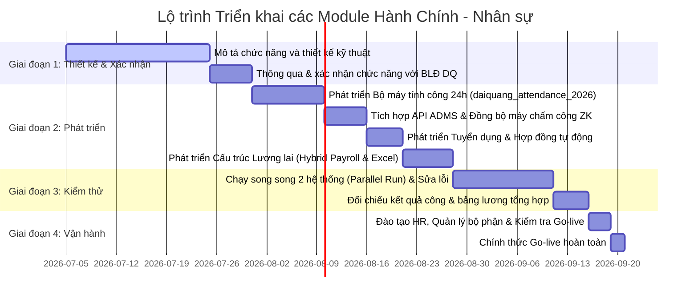

# KẾ HOẠCH NÂNG CẤP
## V/v: Nâng cấp & Chuẩn hóa Hệ thống quản lý tuyển dụng, nhân sự, chấm công, tính lương của công ty DQ lên Odoo 19 CE

---

## 1. ĐẶT VẤN ĐỀ


> [!WARNING]
> **Hiện trạng hệ thống cũ (Odoo 14 CE):**
> *   **Can thiệp trực tiếp mã nguồn gốc (Hardcode):** Code viết trước đây sửa đổi trực tiếp vào lõi của Odoo, dẫn đến việc hệ thống xung đột, không thể nâng cấp lên các phiên bản bảo mật cao hơn.
> 
> *   **Hạn chế nghiệp vụ ca kíp:** Không hỗ trợ tự động các ca đêm gối ngày (ca kíp vượt mốc 24:00), dẫn đến việc bộ phận Nhân sự (HR) phải tính toán thủ công rất nhiều, dễ xảy ra sai lệch công và chậm trễ bảng lương.
> 
> *   **Thiếu vết lịch sử:** Việc thay đổi ca của nhân viên chưa được lưu vết tự động theo thời kỳ hiệu lực, gây khó khăn khi tra cứu tranh chấp công trong quá khứ.
> *   **Thiếu hướng dẫn sử dụng:** Vệc vừa triển khai code vừa áp dụng vào sử dụng ngay dẫn đến gặp khá nhiều lỗi logic. Nguyên nhân là chưa có BA chính xác và thiết kế kỹ thuật   
> *   **Giao diện trên thiết bị mobile bị hạn chế:** Ở phiên bản Odoo 14 cộng đồng không hỗ trợ giao diện mobile nên việc sử dụng bắt buộc phải trên máy tính
> *   **Module quản lý máy chấm công không tích hợp với Odoo:** Điều này gây bất tiện trong sử dụng đặc biệt là việc bổ sung thay đổi nhân sự
> 
Việc điều chỉnh và sửa các lỗi logic trên sẽ mất nhiều công sức do đó trong quá trình điều chỉnh sẽ nâng cấp hệ thống lên odoo 19 CE để đảm bảo tính
tương thích, tận dụng được điểm mạnh của phiên bản mới và dễ dàng nâng cấp sau này.


---


## 2. ĐIỂM LẠI CÁC CÔNG VIỆC ĐÃ THỰC HIỆN Ở PHIÊN BẢN 14

### 2.1 Phân hệ quản lý tuyển dụng
#### 2.1.1 Các chức năng đã hoàn thành, đã chạy trên odoo 14
>* **Quản lý hồ sơ ứng viên chuyên sâu:** Tạo hồ sơ ứng viên mới (`hr.applicant`) đúng chuẩn Odoo.
>* **Mở rộng các trường thông tin quản lý:** Bổ sung CCCD, ngày cấp, ngày sinh, giới tính, địa chỉ, ảnh CCCD/Sơ yếu lý lịch/Giấy khám sức khỏe trực tiếp trên form ứng viên.
>* **Xây dựng cấu trúc lương đề xuất:** 
  * Bổ sung lương cơ bản đề xuất (`salary_basic_proposed`), lương trách nhiệm (`salary_responsible_proposed`), lương tay nghề/kinh nghiệm (`salary_experience_proposed`).
  * Tích hợp bảng phụ cấp (`alw_ids`), thưởng (`reward_ids`), giảm trừ (`cutdown_ids`) chi tiết trong tháng.
  * Tự động tính toán Lương Net/Gross đề xuất và tự động dịch số tiền thành chữ tiếng Việt (`str_salary_net_proposed` / `str_salary_gross_proposed`).
* **Ký duyệt thư tuyển dụng:** Liên kết thông tin người ký duyệt (`boss_ids`) và hình ảnh con dấu đại diện của công ty (`seal_image`).

#### 2.1.2 Các chức năng đang còn dở dang hoặc chạy có lỗi
>* **Lỗi hiệu năng hệ thống nghiêm trọng ($O(N^2)$):** Các hàm tính toán trạng thái ứng viên `_compute_candidate_status` và dịch chuyển hồ sơ `move_profile_to_end` viết sai quy chuẩn (gọi hàm `search([])` tìm toàn bộ ứng viên trong cơ sở dữ liệu và lặp lại cho từng người). Điều này làm hệ thống bị treo hoặc chạy rất chậm khi số lượng hồ sơ lớn.
>* **Mẫu in Thư tuyển dụng & Phụ lục lương bị cứng (Hardcoded):** Thư tuyển dụng xuất ra PDF chạy chưa đúng theo mẫu và được lập trình cứng bằng HTML/CSS trong mã nguồn XML QWeb Report, dẫn đến bộ phận Hành chính Nhân sự (HR) không thể tự chỉnh sửa nội dung hoặc thay đổi logo khi cần thiết.
>* **Lỗi thiếu thông tin Chi nhánh khi tạo nhân viên:** Khi bấm nút "Create Employee" chuyển ứng viên thành nhân viên, hệ thống không truyền thông tin Chi nhánh (`branch_id`) sang form nhân viên. Do Chi nhánh là trường bắt buộc nên HR phải nhập lại thủ công.
>* **Thiếu kết nối đồng bộ Hợp đồng lao động:** Sau khi ứng viên đồng ý Thư tuyển dụng, HR phải nhập liệu lại toàn bộ mức lương cơ bản, phụ cấp, thưởng từ ứng viên sang hợp đồng lao động mới của nhân viên một cách thủ công, dễ sai lệch dữ liệu.
>* **Khai báo thẻ in ấn cũ:** Sử dụng thẻ `<report ...>` của Odoo 14, thẻ này không còn được hỗ trợ từ Odoo 15 trở đi, gây lỗi cài đặt trên Odoo 19.

#### 2.1.3 Các chức năng kiến nghị và hướng cải tiến khắc phục khi chuyển đổi lên odoo 19
>* **Khắc phục lỗi hiệu năng:** Viết lại toàn bộ hàm compute trạng thái chỉ xử lý trên tập bản ghi hiện hành (`self`), loại bỏ hoàn toàn việc tìm kiếm toàn bộ database.
>* **Tích hợp Quy trình Hợp đồng lao động tự động (Sau Thư tuyển dụng):**
  * Khi ứng viên xác nhận đồng ý Thư tuyển dụng, hồ sơ tự động chuyển sang trạng thái **"Chờ ký Hợp đồng"**.
  * Khi bấm nút **"Tạo Nhân viên"** (Create Employee), hệ thống Odoo 19 sẽ tự động khởi tạo đồng thời một bản ghi **Hợp đồng lao động nháp** (`hr.contract`) liên kết với nhân viên đó.
  * Tự động ánh xạ toàn bộ thông tin thu nhập đề xuất của ứng viên sang hợp đồng mới (`salary_basic_proposed` -> `wage`, `salary_responsible_proposed` -> `salary_responsible`, `salary_experience_proposed` -> `salary_experience`, tự động tạo các dòng phụ cấp tương ứng). HR chỉ cần rà soát và nhấn kích hoạt hợp đồng.
>* **Tối ưu quy trình chuyển đổi 1-Click:** 
  * Kế thừa hàm `create_employee_from_applicant` để tự động truyền thêm trường Chi nhánh (`default_branch_id = applicant.branch_id.id`) sang form nhân viên.
  * Đồng bộ cơ chế tự động tạo mã nhân viên theo luật phân cấp (`company_code` + `branch_code` + `dept_code` + `counter_code`) ngay khi HR nhấn lưu hồ sơ nhân viên.
>* **Giải pháp tùy biến thư tuyển dụng không dùng Code:** 
  * Chuyển đổi báo cáo QWeb Report cứng sang **Mail Template tích hợp Trình soạn thảo WYSIWYG** của Odoo 19.
  * Cho phép HR tự do thay đổi nội dung thư tuyển dụng, định dạng, font chữ trực tiếp trên giao diện Odoo.
  * Thiết lập nút bấm "In Thư Tuyển Dụng" trên màn hình Ứng viên để xuất tự động nội dung template này thành file PDF trong 1 giây.
>* **Thiết kế Responsive Mobile:** Bố trí lại form ứng viên sử dụng lưới Bootstrap 5 của Odoo 19 để tối ưu hóa hiển thị dọc và cho phép HR thao tác mượt mà trên điện thoại.


### 2.2 Phân hệ quản lý nhân sự
#### 2.2.1 Các chức năng đã hoàn thành, chạy trên odoo 14
>* **Cơ cấu tổ chức đa phân cấp:** 
  * Định nghĩa cơ cấu phòng ban và tổ con ("sub.team") kế thừa từ mô hình cây phòng ban (`hr.department`) của Odoo thông qua liên kết cha-con (`parent_id`), cho phép phân cấp quản lý sâu.
  * Phân quyền xem dữ liệu nhân viên theo phòng ban (`viewers_ids`).
* **Theo dõi và quản lý khám sức khỏe định kỳ:**
  * Thêm bảng theo dõi khám sức khỏe (`employee.health`) liên kết dạng One2many với nhân viên.
  * Tự động tính toán ngày khám gần nhất (`last_health_date`) và phân loại sức khỏe (`last_health_type`).
  * Tự động đánh giá trạng thái khám sức khỏe (`status`): "Khám sức khỏe đầy đủ", "6 tháng chưa khám", "12 tháng chưa khám".
* **Hệ thống cảnh báo thông minh:** Hiển thị nhãn cảnh báo màu sắc trực tiếp trên Kanban view của nhân viên (màu cam khi quá 6 tháng chưa khám, màu đỏ khi quá 12 tháng).
* **Bộ lọc tìm kiếm nhanh:** Tích hợp bộ lọc trên thanh tìm kiếm để HR lọc nhanh danh sách nhân sự chưa khám sức khỏe trong 6 tháng, 12 tháng hoặc chưa khám bao giờ.
* **Quản lý nghỉ phép (Time Off):** Sử dụng phân hệ nghỉ phép tiêu chuẩn (`hr_holidays`) để quản lý phép năm và phê duyệt nghỉ phép.

#### 2.2.2 Các chức năng đang còn dở dang hoặc chạy có lỗi
>* **Xung đột giao diện Kanban trên Odoo 19:** Mã nguồn Kanban cũ kế thừa thẻ `oe_kanban_details` và `o_kanban_record_title` để chèn nhãn cảnh báo sức khỏe. Cú pháp này không còn tồn tại trên Odoo 19 (đã chuyển sang cụm thẻ `<main>` mới), gây ra lỗi giao diện và lỗi ParseError khi cài đặt.
>* **Lỗi logic tính toán ngày tháng trong bộ lọc XML:** Bộ lọc tìm kiếm nhanh sử dụng biểu thức Python `datetime.datetime.now()` viết trực tiếp vào domain XML, dễ dẫn đến lỗi tính toán múi giờ (timezone offset) lệch 1 ngày hoặc lỗi định dạng ngày tháng khi nâng cấp.
>* **Trạng thái sức khỏe không được lưu trữ (Not Stored):** Trường trạng thái `status` là trường compute không lưu trữ trong database, dẫn đến việc không thể gom nhóm (group by) nhân viên theo trạng thái khám sức khỏe trên giao diện danh sách.

#### 2.2.3 Các chức năng kiến nghị và hướng cải tiến khắc phục khi chuyển đổi lên odoo 19
>* **Chuẩn hóa Kanban view:** Viết lại XPath kế thừa Kanban tương thích hoàn toàn với cấu trúc thẻ mới của Odoo 19 (sử dụng `<main>` và Bootstrap 5).
>* **Tối ưu hóa trường dữ liệu:** Chuyển trường trạng thái sức khỏe `status` sang dạng lưu trữ (`store=True`) và thiết lập các trigger phụ thuộc (`@api.depends`) chuẩn xác để có thể tìm kiếm, gom nhóm và báo cáo nhanh chóng.
>* **Chuẩn hóa múi giờ trong bộ lọc:** Sử dụng hàm chuẩn `context_today()` của Odoo thay cho `datetime.datetime.now()` trong XML domain để xử lý ngày tháng theo đúng múi giờ làm việc của nhân sự tại Việt Nam.
>* **Tích hợp đính kèm hồ sơ y tế:** Bổ sung tính năng cho phép HR đính kèm trực tiếp file PDF kết quả khám sức khỏe vào từng dòng lịch sử khám sức khỏe của nhân viên để tiện tra cứu lại chỉ số khi cần.


### 2.3 Phân hệ chấm công và tính công
#### 2.3.1 Các chức năng đã hoàn thành, chạy trên odoo 14
>* **Ghi nhận lượt quét vân tay/thẻ:** Ghi nhận sự kiện Check-in/Check-out của nhân viên tại các địa điểm chi nhánh.
>* **Khai báo ca làm việc cơ bản:** Cấu hình ca làm việc cố định theo ngày.
>* **Báo cáo chấm công cơ bản:** Xuất báo cáo đi trễ, về sớm.

#### 2.3.2 Các chức năng đang còn dở dang hoặc chạy có lỗi
>* **Logic tính công lỗi thời & Phức tạp:** Bộ máy tính công cũ của Odoo 14 hoạt động không chính xác đối với ca đêm gối ngày (ca làm việc kéo dài qua 24:00 hôm sau), gây ra hiện tượng mất công hoặc tính sai giờ làm việc của công nhân.
>* **Kết nối máy chấm công thụ động:** Việc đồng bộ dữ liệu máy chấm công ZKTeco trước đây được xử lý qua công cụ phần mềm trung gian bên thứ ba (hoạt động theo cơ chế pull dữ liệu gián tiếp), thường xuyên mất kết nối, khó sửa đổi thông tin nhân sự và không đồng bộ được mã hóa vân tay.
>* **Chưa đồng bộ với bảng lương:** Dữ liệu ngày công thực tế chưa được đẩy trực tiếp sang inputs của bảng lương, dẫn đến việc HR phải xuất excel đối chiếu thủ công rất mất thời gian.

#### 2.3.3 Các chức năng kiến nghị và hướng cải tiến khắc phục khi chuyển đổi lên odoo 19
>* **Hủy bỏ hoàn toàn logic tính công cũ:** Thay thế bằng bộ máy tính công ngày thông minh (`daiquang_attendance_2026`) dựa trên 2 yếu tố: Mã ca và Số lượt check trong chu kỳ cửa sổ 24h của ca. Tích hợp làm tròn 15 phút, tự động bóc tách OT gối ngày sau và chế độ HR phê duyệt sửa công thủ công.
>* **Tích hợp Module quản lý máy chấm công trực tiếp (ZK ADMS):**
  * Thiết kế lại giao thức **ADMS (Automatic Data Master Server)** dựa trên nguyên mẫu module `aliswork` (Odoo 9) chạy trực tiếp trên Odoo 19.
  * Máy chấm công ZKTeco tại các chi nhánh sẽ tự động kết nối và đẩy dữ liệu check-in/out (real-time push) về các endpoints `/iclock/cdata` của Odoo 19 qua internet, không cần mở cổng port mạng LAN chi nhánh.
  * Định nghĩa mô hình quản lý máy chấm công (`hr.zk.machine`), Mã PIN nhân viên trên máy (`hr.employee.zk.pin`), và hàng đợi lệnh đồng bộ (`hr.zk.machine.cmd`) để tự động tạo mới, cập nhật tên hoặc xóa nhân viên trên máy chấm công ngay từ Odoo.
  * Tự động lưu trữ và đồng bộ hóa dữ liệu mẫu vân tay (`hr.zk.fingerprint.template`) của nhân viên để có thể dễ dàng đồng bộ sang máy chấm công mới khi thay đổi thiết bị.
  * Parser dữ liệu ATTLOG nhận được từ máy chấm công để ghi nhận trực tiếp vào sự kiện quét thẻ `hr.attendance.event` làm đầu vào tính công ngày.

>

### 2.4 Phân hệ tính lương
#### 2.4.1 Các chức năng đã hoàn thành, chạy trên odoo 14
>* **Định nghĩa danh mục lương:** Cấu hình các danh mục (BASIC, ALW, GROSS, DED, NET) và một số quy tắc tính lương cơ bản.
>* **Cấu trúc lương:** Khai báo cấu trúc lương cho các khối văn phòng/nhà máy.
#### 2.4.2 Các chức năng đang còn dở dang hoặc chạy có lỗi
>* **Cấu hình Rule quá phức tạp và khó bảo trì (Khảo sát thực tế hệ thống hiện tại có tới 148 quy tắc lương):** 
  * Hiện trạng trên database đang chạy cấu hình tới **148 rules**, với các công thức Python dài dòng và phức tạp được viết trực tiếp trong database.
  * Ví dụ quy tắc tính **Lương cơ bản thử việc thực tế (`LgThCtTN`)** đang gánh đoạn mã Python lồng ghép nhiều điều kiện phức tạp liên quan đến ngày công:
    `result = (inputs.CgTiLg and (categories.BASIC*(inputs.NC.amount-inputs.NgHdTV.amount)/inputs.CgTiLg.amount)) if (inputs.NgHdTV.amount > 0) else ((inputs.CgTiLg and (inputs.LgTnCu.amount*inputs.NgHdCu.amount/inputs.CgTiLg.amount+categories.LgHdKN*(inputs.NC.amount-inputs.NgHdCu.amount)/inputs.CgTiLg.amount)) if (inputs.NgHdCu.amount > 0) else (inputs.CgTiLg and (categories.LgHdKN*inputs.NC.amount/inputs.CgTiLg.amount)))`
  * Ví dụ quy tắc tính **Tổng tiền tăng ca (`OT_SUM`)** đang hardcode trực tiếp các hệ số nhân và số giờ trong DB:
    `result = round((categories.U10/8)*1.5*worked_days.OT01.number_of_hours+(categories.U10/8)*1.95*worked_days.OT02. number_of_hours+... ,0)`
  * Ví dụ quy tắc tính **Ngày công được tính lương (`NC10`)** cộng dồn thủ công các mã công:
    `result = worked_days.NC01.number_of_days+worked_days.NC02.number_of_days*1.3+worked_days.NC03.number_of_days*2+...`
  * Tất cả các rule này đều lặp lại một đoạn code điều kiện kiểm tra không cần thiết: `result = rules.NET > categories.NET * 0.10` gây rối loạn và dễ lỗi đệ quy khi tính toán.
  * Chỉ cần một lỗi cú pháp nhỏ (ví dụ: gõ thừa dấu cách trước `.number_of_hours`) sẽ làm lỗi toàn bộ đợt tính lương của cả công ty.
>* **Nghẽn hiệu năng khi tính lương số lượng lớn:** Việc Odoo chạy hàm `safe_eval()` để thông dịch động 148 quy tắc Python trong DB cho từng nhân viên khiến hệ thống xử lý cực kỳ chậm khi chốt lương tháng.
>* **Số liệu công ngày bị đứt gãy:** Không có cơ chế tự động lấy công từ bảng công ngày (`hr.attendance.day`) sang bảng lương, HR vẫn phải tính tay ra Excel rồi nhập thủ công vào các biến đầu vào của phiếu lương (`hr.payslip`).

#### 2.4.3 Các chức năng kiến nghị và hướng cải tiến khắc phục khi chuyển đổi lên odoo 19 (Kiến trúc Lương tinh gọn - Hybrid Payroll)
Để khắc phục triệt để tính phức tạp và lỗi hiệu năng, chúng tôi đề xuất áp dụng **Kiến trúc Lương tinh gọn (Hybrid Payroll)** trên Odoo 19:
1. **Đơn giản hóa tối đa các Quy tắc Lương trên Odoo (Odoo Rules):**
   * Giảm số lượng Salary Rules trên Odoo xuống mức tối thiểu (chỉ giữ lại các đầu mục tổng: LƯƠNG CƠ BẢN, TỔNG PHỤ CẤP, TỔNG THƯỞNG, TIỀN TĂNG CA, GIẢM TRỪ/BẢO HIỂM, THUẾ TNCN, LƯƠNG THỰC LĨNH).
   * Mỗi quy tắc lương trên Odoo sẽ không chứa code Python phức tạp, mà chỉ lấy trực tiếp giá trị từ các trường đã tính toán sẵn trên phiếu lương (Ví dụ: `result = payslip.ot_amount` hoặc `result = payslip.allowance_amount`).
2. **Đưa toàn bộ công thức toán học phức tạp vào Code Python Backend:**
   * Viết một hàm xử lý tập trung `_compute_salary_components` trực tiếp trong file code Python của module. Hàm này sẽ tự động chạy ngầm, truy vấn số liệu ngày công thực tế từ `hr.attendance.day`, nhân với các hệ số phụ cấp/thưởng trên Hợp đồng lao động (`hr.contract`) để ra kết quả cuối cùng.
   * *Ưu điểm:* Code Python backend chạy nhanh gấp 50 lần so với safe_eval trong DB, dễ kiểm thử (unit test), dễ sửa lỗi và HR hoàn toàn giải phóng khỏi việc phải "lập trình" trên Odoo.
3. **Đồng bộ tự động dữ liệu công ngày:** 
   * Tự động quét và tổng hợp toàn bộ số ngày công làm việc, số giờ tăng ca (OT), số giờ ca đêm từ bảng công ngày (`hr.attendance.day`) trong tháng để đưa thẳng vào tính toán lương mà không qua bước xuất Excel trung gian.
4. **Tùy biến mẫu in phiếu lương bằng Excel:**
   * Tích hợp công cụ kết xuất phiếu lương và bảng lương tổng hợp ra Excel theo đúng định dạng biểu mẫu (font chữ, viền bảng, cột lương) của Đại Quang để gửi cho ngân hàng và người lao động một cách chuyên nghiệp.
5. **Tự động phân phối phiếu lương qua Zalo OA và Email (Bảo mật cao):**
   * *Gửi qua Email:* Tự động xuất file PDF phiếu lương chi tiết cho từng nhân viên, đính kèm vào email gửi đi. Để bảo mật thông tin thu nhập, tệp tin PDF sẽ được mã hóa bằng mật khẩu kết hợp từ thông tin cá nhân của nhân sự (ví dụ: 4 số cuối CCCD + năm sinh).
   * *Gửi qua Zalo (Zalo Notification Service - ZNS):* Tích hợp tài khoản Zalo Official Account (OA) của Đại Quang qua API. Hệ thống sẽ tự động gửi tin nhắn Zalo chứa các thông tin thu nhập tóm tắt (Tháng lương, Lương thực lĩnh) kèm một đường link liên kết web bảo mật có mã token (hết hạn sau 15 ngày) để nhân viên click vào xem toàn bộ bảng lương chi tiết trên Portal của Odoo.
   * *Lợi ích:* Tiết kiệm thời gian in ấn, phân phát phiếu lương giấy của HR, tăng tính bảo mật, và đảm bảo thông tin đến trực tiếp tay người lao động nhanh chóng.

### 2.5 Phân hệ Quản lý phương tiện và chi phí xe
#### 2.5.1 Các chức năng đã hoàn thành, chạy trên Excel (Tài liệu tham chiếu `So_quan_ly_xe_DQ.xlsx`)
>* **Theo dõi nhật trình sử dụng xe:** Lưu trữ ngày/tháng sử dụng, người điều xe, người lái xe, người sử dụng, thông tin xe (biển số, loại xe), lịch trình (điểm đi, điểm đến), và mục đích sử dụng.
>* **Theo dõi chỉ số tiêu hao nhiên liệu thực tế:** Ghi nhận số chỉ km khi đổ xăng/dầu, số hóa đơn, số lít đổ đầy và số tiền đã bao gồm VAT.
>* **Tổng hợp chi phí vận hành:** Thống kê chi phí theo từng đầu xe bao gồm chi phí xăng dầu, chi phí bảo dưỡng/sửa chữa, chi phí đăng kiểm, vé cầu đường.
>* **Lên lịch cảnh báo bảo trì:** Tính toán ngày đến hạn đăng kiểm tiếp theo và số km dự kiến thay dầu máy (cứ 5,000km cần thay dầu).

#### 2.5.2 Các chức năng đang còn dở dang hoặc chạy có lỗi trên Excel
>* **Thao tác thủ công, thiếu cảnh báo thời gian thực:** HR hoặc Kế toán phải nhập tay 100% số liệu. Việc tính toán độ lệch tiêu thụ thực tế so với định mức tiêu hao xăng dầu (tô màu vàng nếu vượt 10-20%, tô màu đỏ nếu vượt >20%) được cấu hình bằng các công thức Excel dễ bị lỗi khi kéo dòng.
>* **Thiếu cơ chế cảnh báo tự động:** Không có hệ thống nhắc nhở tự động (pop-up/email notification) khi xe sắp đến hạn đăng kiểm hoặc đến hạn thay dầu, dễ dẫn đến việc xe quá hạn đăng kiểm hoặc hỏng hóc do quên thay dầu máy.
>* **Khó theo dõi lịch trình tài xế:** Dữ liệu phân tán, không có lịch trực trực quan (Calendar view) để xem tài xế nào đang bận hoặc xe nào đang trống lịch di chuyển.

#### 2.5.3 Các chức năng kiến nghị và hướng cải tiến khắc phục khi chuyển đổi lên Odoo 19 (Tích hợp Phân hệ Odoo Fleet)
Chúng tôi đề xuất chuyển đổi toàn bộ quy trình từ file Excel sang module **Quản lý Phương tiện (Fleet Management)** tùy biến trên Odoo 19:
1. **Quản lý thông tin xe và Định mức tiêu hao:**
   * Số hóa danh mục xe (`fleet.vehicle`), bao gồm biển số, loại xe, định mức tiêu hao quy định (lít/100km) và Km hiện tại.
   * Tích hợp lịch trực trực quan (Calendar View) giúp HR dễ dàng điều phối xe trống và tài xế trống.
2. **Tự động tính toán và Cảnh báo Tiêu thụ nhiên liệu:**
   * Tạo giao diện ghi nhận đổ nhiên liệu (`fleet.vehicle.log.fuel`). Mỗi lần đổ xăng (yêu cầu đổ đầy bình), Odoo tự động tính:
     $$\text{Tiêu thụ thực tế (L/100km)} = \frac{\text{Số lít đổ đầy}}{\text{Số km chênh lệch giữa 2 lần đổ}} \times 100$$
   * Tự động so sánh với định mức xe. Nếu tiêu thụ thực tế vượt từ 10% - 20%, hệ thống tự động đổi màu trạng thái thành màu Vàng (Cảnh báo), nếu vượt trên 20% sẽ đổi màu Đỏ (Nghiêm trọng).
3. **Quản lý Chi phí vận hành và Đối chiếu kế toán:**
   * Phân loại chi phí xe thành 4 nhóm rõ rệt: Nhiên liệu, Bảo dưỡng/sửa chữa (không bao gồm đăng kiểm), Đăng kiểm, Cầu đường.
   * Tích hợp trường ngày thanh toán thực tế của kế toán để đồng bộ tiến độ thanh toán hóa đơn xe.
4. **Cảnh báo nhắc nhở tự động (Smart Reminders):**
   * *Nhắc thay dầu:* Hệ thống so sánh Km hiện tại với Km thay dầu gần nhất. Khi hiệu số đạt $\ge 5,000$ km, Odoo sẽ hiển thị cảnh báo đỏ và gửi email nhắc nhở tài xế/HR mang xe đi thay dầu máy.
   * *Nhắc đăng kiểm:* Tự động tính ngày đến hạn đăng kiểm dựa trên chu kỳ đăng kiểm (ví dụ: 180 ngày, 365 ngày) và hiển thị thông báo trên Dashboard trước ngày hết hạn 15 ngày.


## 3. MỤC TIÊU DỰ ÁN

1.  **Chuẩn hóa Kiến trúc hệ thống (Clean Code):** Áp dụng phương pháp kế thừa (inheritance) tiêu chuẩn của Odoo. Tuyệt đối không chỉnh sửa trực tiếp vào mã nguồn gốc để đảm bảo hệ thống vận hành ổn định, an toàn bảo mật và dễ dàng nâng cấp lên các phiên bản cao hơn trong tương lai.
2.  **Đồng bộ luồng dữ liệu khép kín (End-to-End Integration):** Xây dựng chuỗi liên kết dữ liệu tự động: Tuyển ứng viên ➔ Ký hợp đồng lao động ➔ Đồng bộ PIN/Tên nhân viên sang máy chấm công ZK ➔ Đẩy dữ liệu check quét vân tay về Odoo ➔ Tính công ngày ➔ Tính lương tự động. Loại bỏ hoàn toàn các bước kết xuất/nhập tay bằng Excel thủ công giữa các bộ phận.
3.  **Tự động hóa & Tối ưu độ chính xác Chấm công:** Tự động nhận diện và tính toán chuẩn xác ca đêm gối ngày, ca gãy, tăng ca (OT) dựa trên chu kỳ cửa sổ 24h của ca và thuật toán làm tròn 15 phút.
4.  **Số hóa & Đơn giản hóa Quy trình quản lý:** 
    *   Hỗ trợ ký duyệt và quản lý lịch sử đổi ca theo mốc thời gian hiệu lực thực tế.
    *   HR có thể tự quản lý mẫu thư tuyển dụng, phụ lục lương trực quan (WYSIWYG) mà không cần đến lập trình viên can thiệp sửa code XML.
5.  **Tối ưu hiệu năng & Giảm tải cấu hình:** Áp dụng kiến trúc lương lai (Hybrid Payroll) nhằm giảm số lượng quy tắc lương từ 148 rules xuống mức tối thiểu, đưa toàn bộ công thức tính toán phức tạp vào code Python backend giúp nâng cao tốc độ tính toán gấp 50 lần, hạn chế tối đa lỗi cú pháp trên giao diện.
6.  **Trải nghiệm đa nền tảng (Mobile-First):** Tận dụng tối đa giao diện tương thích responsive của Odoo 19 để các Trưởng bộ phận và HR có thể duyệt công, duyệt tăng ca, duyệt phép trực tiếp bằng điện thoại di động mọi lúc mọi nơi.
7.  **Bảo mật sinh trắc học và vết lịch sử kiểm toán:** Lưu vết lịch sử đổi ca, ghi nhận thông tin vân tay/CCCD an toàn để đảm bảo tính minh bạch khi có tranh chấp công lương, bảo vệ quyền lợi hợp pháp cho cả doanh nghiệp và người lao động.

---

## 4. KHUNG GIẢI PHÁP KỸ THUẬT ĐỀ XUẤT

Giải pháp kỹ thuật tổng thể trên Odoo 19 CE được phân tách thành 5 trụ cột chức năng khép kín sau:

### 4.1. Trụ cột Chấm công & Bộ máy tính công ngày (`daiquang_attendance_2026`)
Đây là cốt lõi của giải pháp xử lý ca kíp phức tạp và ca đêm gối ngày:

| Giải pháp chi tiết | Cách thức hoạt động | Lợi ích mang lại |
| :--- | :--- | :--- |
| **Cấu hình ca theo thứ** | Thiết lập bảng chi tiết Mã ca làm việc theo từng thứ trong tuần (`hr.attendance.shift.line`), xác định số lượt check yêu cầu (2 hoặc 4 lần). | Đáp ứng mọi mô hình ca kíp phức tạp (ca ngày, ca đêm luân phiên). |
| **Làm tròn công 15 phút** | Tự động làm tròn mốc quét thẻ thực tế về block 15 phút gần nhất trước khi tính toán. | Giảm thiểu tranh chấp nhỏ lẻ về phút chấm công, chuẩn hóa dữ liệu đầu vào. |
| **Tính toán theo chu kỳ 24h** | Gom tất cả lượt check trong chu kỳ 24h của ca (không phụ thuộc vào ngày lịch). | Giải quyết triệt để ca đêm vượt mốc 24h00 hôm sau. |
| **Bóc tách tăng ca (OT) gối ngày** | Tự động tách phần giờ làm việc vượt quá 24h của ca hiện tại chuyển tiếp sang ngày hôm sau dưới dạng chờ duyệt. | Tính đúng, đủ quyền lợi tăng ca cho nhân viên làm ca đặc biệt. |
| **Lịch sử đổi ca** | Lưu vết đổi ca của nhân viên có mốc hiệu lực `Từ ngày - Đến ngày` và người duyệt. | Đảm bảo tính chính xác khi tính công hồi tố cho các ngày trong quá khứ. |

### 4.2. Trụ cột Kết nối & Quản lý Máy chấm công (ZK ADMS)
Tích hợp trực tiếp máy chấm công ZKTeco vào Odoo thông qua giao thức đẩy dữ liệu:

| Giải pháp chi tiết | Cách thức hoạt động | Lợi ích mang lại |
| :--- | :--- | :--- |
| **Giao thức đẩy dữ liệu ADMS** | Odoo 19 mở cổng endpoints `/iclock/cdata` để máy chấm công ZK tự động đẩy dữ liệu check-in/out (real-time push) về server qua internet. | Không cần mở port mạng LAN chi nhánh, loại bỏ phần mềm trung gian không ổn định. |
| **Đồng bộ lệnh hai chiều** | Hàng đợi lệnh (`hr.zk.machine.cmd`) tự động đẩy thông tin tạo mới, sửa tên, hoặc xóa PIN nhân viên xuống máy chấm công. | Quản lý thiết bị tập trung từ Odoo, không cần thao tác trực tiếp trên máy chấm công. |
| **Lưu trữ vân tay tập trung** | Lưu trữ và đồng bộ hóa mẫu vân tay (`hr.zk.fingerprint.template`) của nhân viên trên Odoo. | Dễ dàng chuyển tiếp vân tay sang máy mới khi thay thiết bị mà không cần bắt nhân viên quét lại. |

### 4.3. Trụ cột Tuyển dụng & Tự động hóa Hợp đồng (Recruitment & Contract Flow)
Tối ưu hóa quy trình tiếp nhận nhân sự mới:

| Giải pháp chi tiết | Cách thức hoạt động | Lợi ích mang lại |
| :--- | :--- | :--- |
| **WYSIWYG Mail Template** | Thay thế báo cáo QWeb cứng bằng Mail Template có trình soạn thảo kéo thả của Odoo 19, kết xuất PDF qua nút in nhanh. | HR tự điều chỉnh câu chữ, logo thư mời nhận việc trực tiếp từ Admin Odoo. |
| **Tự động tạo Hợp đồng Nháp** | Khi bấm "Tạo Nhân viên" từ ứng viên trúng tuyển, Odoo tự động khởi tạo bản ghi Hợp đồng lao động nháp (`hr.contract`). | Tránh nhập liệu trùng lặp thông tin hợp đồng. |
| **Ánh xạ dữ liệu lương** | Tự động chuyển các mức lương đề xuất (Cơ bản, Trách nhiệm, Kinh nghiệm, Phụ cấp) từ Ứng viên sang Hợp đồng mới. | Đảm bảo đồng bộ thông tin thu nhập đã thỏa thuận với ứng viên. |
| **Đồng bộ Mã Nhân viên** | Tự động điền Chi nhánh (`branch_id`) và kích hoạt sinh Mã nhân sự phân cấp khi lưu hồ sơ. | Đảm bảo tuân thủ luật sinh mã nhân sự của công ty Đại Quang. |

### 4.4. Trụ cột Quản lý Nhân sự & Sức khỏe (HR & Medical Tracking)
Theo dõi y tế và cảnh báo trạng thái khám sức khỏe:

| Giải pháp chi tiết | Cách thức hoạt động | Lợi ích mang lại |
| :--- | :--- | :--- |
| **Lịch sử khám sức khỏe** | Thêm bảng theo dõi khám sức khỏe (`employee.health`) dạng One2many liên kết với nhân sự. | Lưu trữ tập trung loại sức khỏe, ngày khám, ghi chú y tế. |
| **Trạng thái Stored Status** | Lưu trữ trường trạng thái sức khỏe (`store=True`) với các phụ thuộc dependencies chuẩn xác. | Cho phép gom nhóm (group by) và lọc nhanh nhân viên theo tình trạng sức khỏe trên list view. |
| **Múi giờ chuẩn bộ lọc** | Sử dụng hàm `context_today()` thay thế cho `datetime.datetime.now()` trong XML domain. | Đảm bảo tính toán múi giờ chuẩn xác, không bị lệch ngày. |
| **Kanban Cảnh báo Bootstrap 5** | Sử dụng XPath Kanban mới tương thích Bootstrap 5 của Odoo 19 để chèn nhãn cảnh báo y tế (Cam >6 tháng, Đỏ >12 tháng). | Giao diện cảnh báo trực quan, hiện đại, không bị ParseError khi cài đặt. |

### 4.5. Trụ cột Lương tinh gọn (Hybrid Payroll Architecture)
Đơn giản hóa cấu trúc tính toán lương:

| Giải pháp chi tiết | Cách thức hoạt động | Lợi ích mang lại |
| :--- | :--- | :--- |
| **Tối giản hóa Rules trên Odoo** | Thu gọn 148 rules cũ xuống chỉ còn các rules tổng hợp chính (Lương cơ bản, Tăng ca, Phụ cấp, Giảm trừ...). | Giao diện phiếu lương trực quan, HR dễ theo dõi và giải thích cho nhân viên. |
| **Đưa công thức vào Python Code** | Viết hàm `_compute_salary_components` xử lý mọi phép tính toán lương cơ bản, hệ số OT, bảo hiểm trực tiếp ở backend. | Tăng tốc độ tính toán gấp 50 lần, loại bỏ hoàn toàn lỗi cú pháp Python trong DB. |
| **Tích hợp Công ngày tự động** | Tự động lấy số ngày công, giờ OT, giờ ca đêm từ `hr.attendance.day` làm đầu vào tính toán lương. | Loại bỏ khâu kết xuất Excel trung gian và nhập tay thủ công. |
| **Kết xuất Bảng lương Excel** | Tích hợp thư viện xuất bảng lương tổng hợp và phiếu lương ra Excel theo đúng template quy định. | Chuyên nghiệp hóa hồ sơ lương gửi ngân hàng và người lao động. |
| **Phân phối qua Zalo & Email** | Tích hợp Zalo ZNS API và Mail Server SMTP, tự động đính kèm PDF mã hóa mật khẩu hoặc gửi tin nhắn kèm link web bảo mật. | Tiết kiệm chi phí in ấn của HR, đảm bảo thông tin thu nhập bảo mật đến tận tay nhân viên. |

### 4.6. Trụ cột Quản lý phương tiện và tài xế (Odoo Fleet Customization)
Số hóa sổ đăng ký và tự động hóa cảnh báo phương tiện:

| Giải pháp chi tiết | Cách thức hoạt động | Lợi ích mang lại |
| :--- | :--- | :--- |
| **Quản lý thông tin & Lịch trực xe** | Lưu trữ danh mục xe (`fleet.vehicle`), tài xế (`hr.employee` / Driver) và hiển thị lịch trực di chuyển trực quan (Calendar View). | HR dễ dàng điều phối tài xế và kiểm tra xe trống tức thời. |
| **Tính toán tiêu thụ thực tế** | Giao diện đổ nhiên liệu (`fleet.vehicle.log.fuel`) ghi nhận số km, số lít đổ đầy (yêu cầu đổ đầy bình). Odoo tự động tính tiêu thụ (L/100km). | Loại bỏ tính toán thủ công trên Excel, có dữ liệu chuẩn xác để đối chiếu. |
| **Cảnh báo vượt định mức** | So sánh tiêu thụ thực tế với định mức xăng quy định của xe. Tự động đổi màu cảnh báo (Vàng nếu vượt 10-20%, Đỏ nếu vượt >20%). | Kiểm soát gian lận xăng dầu và phát hiện kịp thời xe có dấu hiệu hỏng hóc gây tốn nhiên liệu. |
| **Cảnh báo bảo trì & Thay dầu** | Hệ thống tự động so sánh Km hiện tại với Km thay dầu máy gần nhất. Nếu khoảng cách đạt $\ge 5,000$ km sẽ hiển thị cảnh báo đỏ. | Tránh hỏng hóc xe do quên bảo dưỡng định kỳ. |
| **Theo dõi hạn Đăng kiểm & Bằng lái** | Cảnh báo tự động trên Dashboard khi xe sắp đến hạn đăng kiểm hoặc tài xế sắp hết hạn bằng lái trước 15 ngày. | Đảm bảo tuân thủ an toàn pháp lý khi tham gia giao thông. |

---

## 5. KẾ HOẠCH DI CƯ DỮ LIỆU (DATA MIGRATION PLAN)

Để chuyển đổi thành công từ Odoo 14 cũ sang Odoo 19 mới mà không làm gián đoạn vận hành, ban dự án đề xuất kế hoạch di cư dữ liệu chi tiết sau:

### 5.1. Phạm vi di cư dữ liệu
Dữ liệu di cư được phân nhóm và trích xuất theo các mô hình dữ liệu (Models) sau:

1.  **Dữ liệu Danh mục gốc (Master Data - Bắt buộc chuyển đổi 100%):**
    *   **Cơ cấu tổ chức:** Công ty (`res.company`), Chi nhánh (`branch`), Phòng ban (`hr.department`), Chức vụ (`hr.job`).
    *   **Hồ sơ nhân viên (`hr.employee`):** Mã nhân viên, Họ tên, CMND/CCCD, Ngày sinh, Quê quán, Địa chỉ, Số tài khoản ngân hàng, Thông tin liên hệ, Ngày vào làm.
    *   **Lịch sử khám sức khỏe (`employee.health`):** Kết quả khám, loại sức khỏe, ngày khám, và file PDF đính kèm.
    *   **Hợp đồng lao động (`hr.contract`):** Lịch sử hợp đồng cũ, các mức lương (cơ bản, phụ cấp lương, thưởng doanh số) và thời hạn hiệu lực.
    *   **Sinh trắc học vân tay:** Đồng bộ mã hóa vân tay (`hr.zk.fingerprint.template`) và Mã PIN máy chấm công của từng nhân sự từ module `aliswork` cũ.
2.  **Dữ liệu Giao dịch (Transactional Data - Di cư lịch sử 6 tháng gần nhất để đối chiếu):**
    *   **Sự kiện quét thẻ thô (`hr.attendance.event`):** Ghi nhận tất cả các lượt check-in/out thô đẩy về từ máy chấm công.
    *   **Bảng công ngày đã chốt (`hr.attendance.day`):** Lịch sử công ngày cũ làm căn cứ tính phép năm và quyết toán thuế.
    *   **Phiếu lương lịch sử (`hr.payslip`):** Lịch sử các phiếu lương đã chi trả phục vụ tra cứu.

### 5.2. Chiến lược di cư kỹ thuật
Tuyệt đối không sử dụng phương pháp nhập file Excel/CSV thủ công vì dễ làm mất liên kết ID quan hệ giữa nhân viên - hợp đồng - chi nhánh.

*   **Công cụ di cư (Migration Tool):** Viết tập lệnh Python độc lập (ETL Migration Script) sử dụng thư viện kết nối **XML-RPC API** để đọc trực tiếp dữ liệu từ Odoo 14 (Source) và ghi tự động sang Odoo 19 (Target).
*   **Xử lý ánh xạ (Data Mapping):**
    *   Tự động ánh xạ các ID cũ từ Odoo 14 thành các khóa ngoại tương ứng trên Odoo 19.
    *   Lưu trữ ID cũ của Odoo 14 vào trường tham chiếu `old_system_id` trên Odoo 19 để phục vụ kiểm tra đối chiếu (Audit Trail).
    *   Đồng bộ trực tiếp tệp tin PDF đính kèm (hồ sơ y tế, hợp đồng) dưới dạng file nhị phân (Binary) qua API.

### 5.3. Quy trình thực hiện & Thời gian đóng băng dữ liệu (Freeze Window)
Quy trình thực hiện di cư chính thức sẽ diễn ra trong **48 giờ** cuối tuần để không ảnh hưởng đến hoạt động sản xuất:

```
[Thứ Sáu 18:00] Đóng băng dữ liệu (Freeze) trên Odoo 14
       │
       ▼
[Thứ Sáu 19:00] Chạy Script ETL di cư Master Data (HR & Contract)
       │
       ▼
[Thứ Bảy 08:00] Chạy Script di cư dữ liệu lịch sử & Đồng bộ Vân tay ZK
       │
       ▼
[Thứ Bảy 14:00] Đội dự án chạy kiểm tra tính toàn vẹn (Data Integrity Check)
       │
       ▼
[Chủ Nhật 09:00] Phòng HR vào nghiệm thu dữ liệu chéo (UAT Data Verification)
       │
       ▼
[Thứ Hai 08:00] Mở hệ thống Odoo 19 chính thức Go-live
```

---

## 6. LỘ TRÌNH TRIỂN KHAI (ROADMAP)

Dự án dự kiến triển khai theo các giai đoạn chi tiết sau:



---

## 7. ĐÁNH GIÁ RỦI RO & PHƯƠNG ÁN GIẢM THIỂU

> [!IMPORTANT]
> ### Rủi ro 1: Sai lệch số liệu công trong tháng đầu tiên chạy hệ thống mới
> *   *Mô tả:* Nhân viên làm ca đêm hoặc đổi ca đột xuất chưa được cấu hình đúng trên hệ thống mới gây sai lệch giờ công thực tế.
> *   *Giải pháp:* Thiết lập giai đoạn **chạy song song (Parallel Run)** trong vòng ít nhất 1 tháng. Toàn bộ bảng công vẫn được HR đối chiếu thủ công song song với kết quả tự động của Odoo 19 trước khi chốt lương chính thức.
> 
> ### Rủi ro 2: Thiết bị chấm công mất kết nối internet tại chi nhánh
> *   *Mô tả:* Đường truyền mạng internet tại chi nhánh bị hỏng, máy chấm công không thể đẩy dữ liệu check-in/out về Odoo theo thời gian thực.
> *   *Giải pháp:* Thiết lập **Tiến trình chạy lùi tự động (Cron Job recalculate 48h)**. Hệ thống sẽ tự động tính toán lại công của 2 ngày trước đó (T-1 và T-2) vào mỗi đêm để đảm bảo ghi nhận đầy đủ khi máy chấm công có mạng trở lại và đẩy bù dữ liệu.
> 
> ### Rủi ro 3: Người dùng chưa làm quen quy trình phê duyệt trực tuyến
> *   *Mô tả:* Quản lý ca hoặc HR quên không duyệt đơn sửa công/OT trên Odoo làm ảnh hưởng đến tiến độ chốt công lương cuối tháng.
> *   *Giải pháp:* Xây dựng bộ hướng dẫn thao tác nhanh (Quick-step Guide) dạng hình ảnh/video dưới 2 phút và tổ chức 2 buổi đào tạo trực tuyến cho HR và Trưởng bộ phận. Đồng thời cài đặt thông báo nhắc nhở tự động qua Email/Odoo Notification trước kỳ chốt công 3 ngày.
> 
> ### Rủi ro 4: Thiết bị chấm công đời quá cũ không hỗ trợ giao thức ADMS
> *   *Mô tả:* Các máy chấm công cũ sử dụng firmware cũ không hỗ trợ đẩy dữ liệu qua HTTP hoặc không tương thích chuẩn mã hóa vân tay mới.
> *   *Giải pháp:* Đội ngũ kỹ thuật sẽ quét và khảo sát firmware của tất cả máy chấm công tại chi nhánh trong tuần đầu tiên. Với máy hỗ trợ ADMS sẽ tiến hành cập nhật firmware. Với các thiết bị quá cũ (chỉ dùng kết nối cổng COM/TCP nội bộ), ban dự án đề xuất đầu tư thay mới dòng máy ADMS tiêu chuẩn.
> 
> ### Rủi ro 5: Thay đổi công thức tính lương đột xuất giữa tháng
> *   *Mô tả:* Việc thay đổi quy chế phụ cấp, thưởng hoặc mức đóng bảo hiểm xã hội yêu cầu phải chỉnh sửa công thức tính lương ngay lập tức.
> *   *Giải pháp:* Thiết lập bảng tham số cấu hình hệ số (Salary configuration parameters) trên giao diện Odoo. Các công thức tính toán ở backend sẽ đọc dữ liệu từ các tham số này, giúp HR có thể tự sửa đổi mức phụ cấp/hệ số bảo hiểm trực tiếp từ giao diện mà không cần lập trình viên sửa code.

---

## 8. KẾT LUẬN VÀ ĐỀ XUẤT

Như đã trình bày ở trên, việc nâng cấp và cải tiến hệ thống hiện trạng để đáp ứng nhu cầu quản lý vận hành là việc làm 
cấp bách, chúng tôi mong muốn phía công ty nghiên cứu xem xét kỹ kế hoạch này với các điểm lưu ý sau:

1. **Thông qua thiết kế kỹ thuật** của các module độc lập tùy biến:
    *   Module chấm công ca kíp và bóc tách OT 24h (`daiquang_attendance_2026`).
    *   Module kết nối và đồng bộ máy chấm công trực tiếp (`daiquang_zk_adms`).
    *   Module tối ưu hóa và tự động hóa quy trình Tuyển dụng - Hợp đồng.
    *   Module bảng lương tinh gọn hiệu năng cao (Hybrid Payroll tích hợp phân phối phiếu lương tự động qua Zalo OA/Email).
    *   Module quản lý phương tiện và chi phí vận hành xe (Fleet Customization tự động hóa cảnh báo bảo trì/xăng dầu).
2. **Cho phép áp dụng thí điểm** chạy song song đối chiếu dữ liệu trong chu kỳ tính lương tháng hàng tháng trước khi chính thức vận hành đơn nhất trên Odoo 19.
